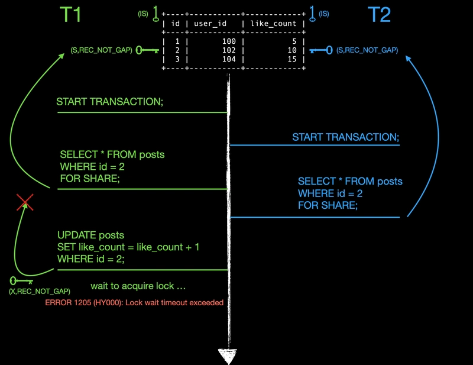
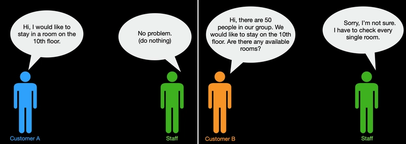
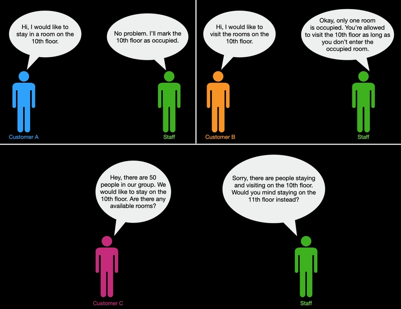
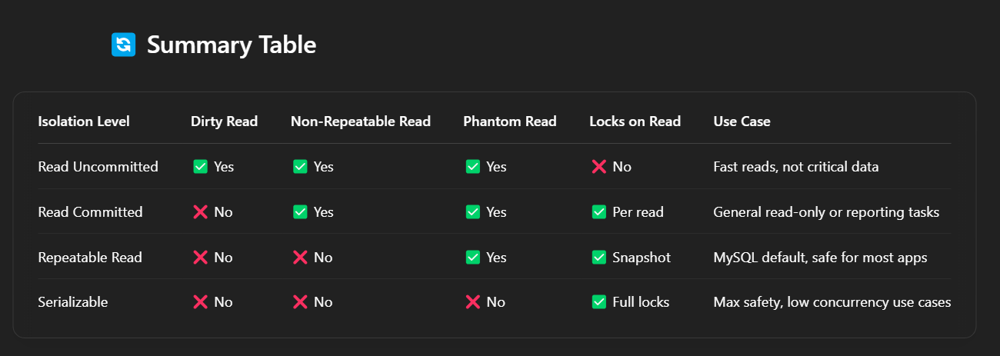
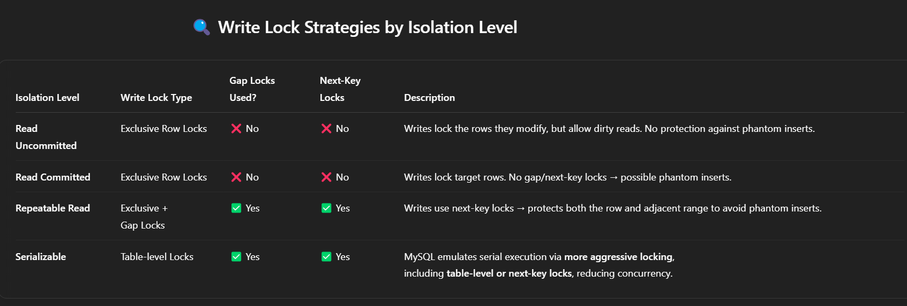

### Three issues of reading data concurrently in mysql
| Issue | Description |
| --- | --- |
| Dirty read | Occurs when a transaction reads uncommitted data that has been handled by another transaction(If it rolls back, the data becomes invalid) |
| Non-Repeatable read | Occurs when a transaction reads the same row twice and get different values each time because another transaction modified it |
| Phantom read | Occurs when a transaction reads rows that match a condition, but on re-execution, it gets additional rows because another transaction added them |
| Non-serializable behavior | Occurs when two or more transactions execute in a way that produces the result could never occur if they were run one at a time. |
#### Phantom rows
- The so-called phantom problem occurs within a transaction when the same query produces different sets of rows at different times. For example, if a SELECT is executed twice, but returns a row the second time that was not returned the first time, the row is a “phantom” row.
- Suppose that there is an index on the id column of the child table and that you want to read and lock all rows from the table having an identifier value larger than 100, with the intention of updating some column in the selected rows later:
```sql
SELECT * FROM child WHERE id > 100 FOR UPDATE;
```
- The query scans the index starting from the first record where id is bigger than 100. Let the table contain rows having id values of 90 and 102. If the locks set on the index records in the scanned range do not lock out inserts made in the gaps (in this case, the gap between 90 and 102), another session can insert a new row into the table with an id of 101. If you were to execute the same SELECT within the same transaction, you would see a new row with an id of 101 (a “phantom”) in the result set returned by the query. If we regard a set of rows as a data item, the new phantom child would violate the isolation principle of transactions that a transaction should be able to run so that the data it has read does not change during the transaction.
- To prevent phantoms, InnoDB uses an algorithm called next-key locking that combines index-row locking with gap locking. InnoDB performs row-level locking in such a way that when it searches or scans a table index, it sets shared or exclusive locks on the index records it encounters. Thus, the row-level locks are actually index-record locks. In addition, a next-key lock on an index record also affects the “gap” before the index record. That is, a next-key lock is an index-record lock plus a gap lock on the gap preceding the index record. If one session has a shared or exclusive lock on record R in an index, another session cannot insert a new index record in the gap immediately before R in the index order.
- When InnoDB scans an index, it can also lock the gap after the last record in the index. Just that happens in the preceding example: To prevent any insert into the table where id would be bigger than 100, the locks set by InnoDB include a lock on the gap following id value 102.
- You can use next-key locking to implement a uniqueness check in your application: If you read your data in share mode and do not see a duplicate for a row you are going to insert, then you can safely insert your row and know that the next-key lock set on the successor of your row during the read prevents anyone meanwhile inserting a duplicate for your row. Thus, the next-key locking enables you to “lock” the nonexistence of something in your table.
#### Serialization Anomaly(Non-serializable behavior) in MySQL
 - Let’s walk through a classic case involving range reads and inserts — where phantoms can occur in [REPEATABLE READ](#transaction-isolation-levels) and cause anomalies.
 - Set up:
 ```sql
 CREATE TABLE accounts (
    id INT PRIMARY KEY,
    balance INT
);

INSERT INTO accounts VALUES (1, 100), (2, 200);
 ```
 - Session 1:
 ```sql
 START TRANSACTION;
SELECT SUM(balance) FROM accounts WHERE balance -= 100;  -- total is 300

-- Waits (does something else)
 ```
 - Session 2:
 ```sql
 START TRANSACTION;
INSERT INTO accounts VALUES (3, 150);
COMMIT;
 ```
 - Session 1 again:
 ```sql
 SELECT SUM(balance) FROM accounts WHERE balance -= 100;  -- Now total is 450
COMMIT;
 ```
#### What's the problem
Session 1 ran the same query twice, expecting the same result ([REPEATABLE READ](#transaction-isolation-levels)), but got different answers (300 ➜ 450).
Even worse:
This change is not visible in any serial execution of the two transactions.
 - If Session 1 ran first, it would never have seen id=3.
 - If Session 2 ran first, Session 1 would have seen 450 from the start.
#### Why does this happen in [REPEATABLE READ](#transaction-isolation-levels)?
That’s a serialization anomaly — a state that could not have occurred in any serial order of the two transactions.
In MySQL InnoDB (default [REPEATABLE READ](#transaction-isolation-levels)):
Reads use snapshot MVCC — so you see a consistent snapshot of rows as of transaction start, not including new inserts unless they match locked ranges.
But non-locked range queries (like the SUM(balance -= 100)) don’t prevent phantom rows from appearing unless you explicitly lock the range.
### There are four isolation levels in mysql when handling concurrency focusing on InnoDB
### Before going over the isolation levels in mysql, we need to understand different lock types using for handling isolation.
#### Lock types overview
| Lock types | Description |
| --- | --- | 
| Shared Lock(S) | Acquired on reads, multiple shared locks allowed but block exclusive locks | 
| Exclusive lock(X) | Acquired on writes, block both shared and exclusive locks | 
 - Example

 - Transaction T1 vs T2 start their own transaction
 - T1 request and acquire the shared lock on the row where id = 2 by using select ... for update
 - T2 request and acquire the same level lock on the same row. T2 is granted the shared lock because they are compatible with each other
 - T1 attempt to modify the selected row and acquire the exclusive lock. T1 has to wait until T2 releases shared lock because a shared lock is not compatible with an exclusive lock. Which means exclusive locks will be blocked until a shared lock is released.

| Lock types | Description |
| --- | --- | 
| Intention lock | table-level locks that indicate which type of lock(S vs X) a transaction intend to acquire later for a row in a table | 
 - There are two types of intention locks
 - An intention shared lock indicates a transaction intends to set a shared lock on rows in a table
 - An intention exclusive lock indicates a transaction intends to set an exclusive lock on rows in a table
 - For example, SELECT ... FOR SHARE sets an IS lock, and SELECT ... FOR UPDATE sets an IX lock.
 - The intention locking protocol is as follow:
 - Before a transaction can acquire a shared lock, it must acquire IS lock first or stronger lock on the table.
 - Before a transaction can acquire an exclusive lock, it must acquire IX lock first on the table.
 - A lock is granted if it is compatible with the existing lock, if not it conflicts with the existing lock, it will wait until the conflicting existing lock is released. Because it would cause deadlock.
 - Intention locks don't lock anything except the table lock(LOCK TABLE...WRITE) The main purpose of intention lock is to indicate that someone is locking a row or going to lock a row.

 ### Why Intention lock is important.
 Let's image you make a reservation on the 10th floor.
 - Scenario A:
In this scenario, the staff does nothing specific regarding the floor level when a customer comes in to stay or visit.

- This example can be inefficient as the staff has to check each room when Customer B asks for rooms on the entire floor.
 - Scenario B:
 In this scenario, the staff treats every customer as if they were the president, blocking the entire floor whenever a customer stays or visits.
 
- This significantly decreases the utilization of rooms when the staff blocks the whole floor for Customer A.
 - Scenario C:
 In this scenario, the hotel does not block the entire floor when a customer stays or visits. Instead, it marks the floor to indicate that someone is occupying it.
 
 - In this example, InnoDB puts a mark on the table to indicate that there's a lock on some row. This allows further transactions to access the same table and respond to the table-level lock without checking each row.

| Lock types | Description |
| --- | --- | 
| Record lock | row-level lock on an index record |
 - For example, SELECT c1 FROM t WHERE c1 = 10 FOR UPDATE; prevents any other transaction from inserting, updating, or deleting rows where the value of t.c1 is 10.
 - Record locks always lock on index records, even if the table is not defined with no indexes. InnoDb creates a hidden [clustered](#clustered-index) index to use it as index for record locking.

| Lock types | Description |
| --- | --- | 
| Gap lock | a lock on a gap between record indexes or a lock on a gap that is before and after the last index record |
 - For example, SELECT c1 FROM t WHERE c1 BETWEEN 10 and 20 FOR UPDATE; prevents other transactions from inserting a value of 15 into column t.c1, whether or not there was already any such value in the column, because the gaps between all existing values in the range are locked.
 - Gap locks are part of the tradeoff between performance and concurrency, and are used in some transaction isolation levels and not others.
 - Gap locking is not needed for statements that lock rows using a unique index to search for a unique row. (This does not include the case that the search condition includes only some columns of a multiple-column unique index; in that case, gap locking does occur.) For example, if the id column has a unique index, the following statement uses only an index-record lock for the row having id value 100 and it does not matter whether other sessions insert rows in the preceding gap:
 - SELECT * FROM child WHERE id = 100;
 - If id is not indexed or has a nonunique index, the statement does lock the preceding gap.
 ### Visual example of gap locks.
 ```sql
 CREATE TABLE employees (
    id INT PRIMARY KEY
) ENGINE=InnoDB;

INSERT INTO employees VALUES (10), (20), (30);
 ```

 - Now the index is: [10] ---gap--- [20] ---gap--- [30] ---gap--- (∞)
 - When calling `SELECT * FROM employees WHERE id < 20 FOR UPDATE;` this triggers a gap lock.
 - Covers (–∞, 10), the row 10, and (10, 20) — all the way up to but not including 20.
 - No inserts allowed between 10 and 20.
 #### Important!!: Gap locks can co-exist. A gap lock taken by one transaction does not prevent another transaction from taking a gap lock on the same gap. There is no difference between shared and exclusive gap locks. They do not conflict with each other, and they perform the same function.

| Lock types | Description |
| --- | --- | 
| Next-key lock | a combination of an index record lock and a gap lock on the gap before the index record  |

<details>
<summary> the affected range for next-level locks (gap and next-key locks) in a MySQL statement is primarily determined by</summary>
 - The isolation level (especially REPEATABLE READ).
 - The indexes used by the query.
 - The WHERE clause and the range of values being accessed or considered.
 - Whether matching rows are found.
</details>

 - Let's consider a simple products table with an index on the price column
```sql
CREATE TABLE products (
    id INT PRIMARY KEY AUTO_INCREMENT,
    name VARCHAR(255) NOT NULL,
    price DECIMAL(10, 2) NOT NULL,
    INDEX (price)
);

INSERT INTO products (name, price) VALUES
('Laptop', 1200.00),
('Mouse', 25.00),
('Keyboard', 75.00),
('Monitor', 300.00),
('Webcam', 50.00);
```
 - Now, let's simulate two concurrent transactions in the REPEATABLE READ isolation level:
   - Transaction 1:
```sql
START TRANSACTION;
SELECT * FROM products WHERE price - 50.00 FOR UPDATE;
-- This will acquire next-key locks on the index records for price 75.00, 300.00, and 1200.00,
-- and gap locks on the gaps before 75.00, between 75.00 and 300.00, between 300.00 and 1200.00,
-- and after 1200.00.
-- No rows are actually updated in this transaction yet.
```
   - Transaction 2:
```sql
START TRANSACTION;

-- Attempt to insert a new product with a price within one of the locked gaps:
INSERT INTO products (name, price) VALUES ('Tablet', 200.00);
-- This INSERT statement will be blocked because Transaction 1 holds a gap lock
-- in the range where price 200.00 would be inserted (between 75.00 and 300.00).

-- Attempt to update an existing row within the locked range:
UPDATE products SET name = 'Large Monitor' WHERE price = 300.00;
-- This UPDATE statement will also be blocked because Transaction 1 holds a next-key lock
-- on the row with price 300.00.

-- Attempt to insert a new product with a price outside the locked gaps:
INSERT INTO products (name, price) VALUES ('Speaker', 1500.00);
-- This INSERT statement might be allowed if there isn't a gap lock extending beyond 1200.00.
-- The behavior at the end of the index can be implementation-specific but often includes
-- a gap lock after the last index value.

SELECT * FROM products WHERE price = 25.00 FOR UPDATE;
-- This will acquire a next-key lock on the row with price 25.00 and the gap before it.
-- It won't be blocked by Transaction 1's locks as it's outside the price range - 50.00.

COMMIT;
```

| Lock types | Description |
| --- | --- | 
| Insert intention lock | a type of gap lock set by INSERT operations prior to row insertion. This lock signals the intent to insert in such a way that multiple transactions inserting into the same index gap need not wait for each other if they are not inserting at the same position within the gap  |
 - Basically, instead of trying to acquire a full lock right away (which could lead to deadlock or waiting), InnoDB places an Insert Intention Lock to signal its desire to insert, and then it waits for the gap to be unlocked if needed.
 - We notice the insert intention lock is similar to the intention lock but it is supposed to be used for the gap between index records.
   - Scenario without Insert Intention Locks
```sql
-- Session 1:
START TRANSACTION;
SELECT * FROM employees WHERE id -= 20 AND id < 30 FOR UPDATE;
```
 - This creates a next-key lock on (20, 30] — locking that gap and the record.
```sql
-- Session 2:
INSERT INTO employees (id, name) VALUES (25, 'Eve');
```
#### Problem if I-locks didn’t exist:
`When a transaction runs an INSERT, InnoDB performs multiple internal steps under the hood — and some of those steps involve acquiring internal metadata or index-level locks. These aren't exposed to you directly, but they can contribute to deadlocks.`
- Session 2 would block while holding some internal locks itself.
- It might already hold:
  - An IX table lock
  - An index latch
Then it blocks, waiting for Session 1 to release its next-key lock.
- If Session 1 needed to insert into another part of the same index page (say id = 35), it might block behind Session 2’s index latch or IX lock.
- Now they’re waiting on each other = deadlock.

<details>
<summary>Internal locks</summary>

1. Auto-Increment Lock
 - If you're inserting into a table with an AUTO_INCREMENT column, InnoDB may acquire an auto-increment mutex or lock, depending on the configuration.
 - This can block other inserts if not handled properly.
2. Index Page Latches
 - InnoDB uses latches (not the same as row locks!) to coordinate writes to the B+Tree index pages during inserts.
 - If two sessions are inserting into the same index page, they may be waiting on internal page latches.
These latches are short-lived, but they can contribute to deadlocks if not released quickly.
3. Intention Locks on the Table (IS/IX Locks)
 - When you do an INSERT, MySQL will set an IX (Intention Exclusive) lock on the table level.
 - This lock declares: "I'm about to acquire exclusive row-level locks."
So even before it tries to grab the actual row/gap lock, it might already be holding this table-level IX lock.
</details>

### Transaction isolation levels
`Transaction isolation is one of the foundations of database processing. Isolation is the I in the acronym ACID; the isolation level is the setting that fine-tunes the balance between performance and reliability, consistency, and reproducibility of results when multiple transactions are making changes and performing queries at the same time`
- The default isolation level for InnoDB is REPEATABLE READ.

#### UNCOMMITTED READ
- [x] Lock Strategy:
 - Does not acquire shared locks when reading.
 - Can read uncommitted changes from other transactions.
- [x] Problem:
 - Dirty Read: Read data that is modified but not yet committed by another transaction.
 - Other anomalies like non-repeatable reads and phantom reads also possible.
- [x] Advantages:
 - Fastest, least locking.
 - Good for read-heavy, low-risk analytics.
- [x] Disadvantages:
 - Data may be inconsistent or invalid.
 - Dangerous for critical or financial applications.

#### COMMITTED READ
- [x] Lock Strategy:
 - Uses shared locks when reading.
 - Reads only committed data from other transactions.
 - Acquires fresh snapshot on each read.
- [x] Problem:
 - Non-repeatable Reads: Re-reading same row may return different values.
- [x] Advantages:
 - Prevents dirty reads.
 - More consistent than Read Uncommitted.
- [x] Disadvantages:
 - Still not fully repeatable.
 - Slightly more locking than Read Uncommitted.

#### Repeatable Read (⚠️ Default in MySQL)
- [x] Lock Strategy:
 - Uses shared locks when reading.
 - Reads from a consistent snapshot at transaction start.
 - Prevents dirty and non-repeatable reads.
 - Uses gap locks to prevent phantom rows in certain cases.
<details>

<summary>For locking reads</summary>

- For locking reads (SELECT with FOR UPDATE or FOR SHARE), UPDATE, and DELETE statements, locking depends on whether the statement uses a unique index with a unique search condition, or a range-type search condition.
`For a unique index with a unique search condition, InnoDB locks only the index record found, not the gap before it.`
`For other search conditions, InnoDB locks the index range scanned, using gap locks or next-key locks to block insertions by other sessions into the gaps covered by the range.`
- It is not recommended to mix locking statements (UPDATE, INSERT, DELETE, or SELECT ... FOR ...) with non-locking SELECT statements in a single REPEATABLE READ transaction, because typically in such cases you want SERIALIZABLE. This is because a non-locking SELECT statement presents the state of the database from a read view which consists of transactions committed before the read view was created, and before the current transaction's own writes, while the locking statements use the most recent state of the database to use locking. In general, these two different table states are inconsistent with each other and difficult to parse.

</details>

- [x] Problem:
 - Phantom Reads still possible (new rows match WHERE condition after re-query).
- [x] Advantages:
 - Good consistency for most apps.
 - Safe for financial transactions.
- [x] Disadvantages:
 - More locking = potential for more contention.
 - Slightly lower concurrency.

#### Serializable (Highest Isolation)
- [x] Lock Strategy:
 - Full table-level read/write locks.
 - Emulates transactions running one after another.
 - Prevents all anomalies, including phantom reads.
- [x] Problem:
 - Lowest concurrency.
 - High contention and lock waits.
- [x] Advantages:
 - Maximum data consistency.
 - Good for critical tasks like money transfers, financial reports.
- [x] Disadvantages:
 - Performance hit in high-concurrency systems.
 - More deadlocks and blocking.

 
 

#### InnoDB Multi-Versioning
- InnoDB keeps information about old versions of changed rows in undo tablespaces in a data structure called a rollback segment. to support for concurrency and rollback. InnoDB uses the information in the rollback segment to perform the undo operations needed in a transaction rollback. It also uses the information to build earlier versions of a row for a consistent read.
`Undo logs in the rollback segment are divided into insert and update undo logs. Insert undo logs are needed only in transaction rollback and can be discarded as soon as the transaction commits. Update undo logs are used also in consistent reads, but they can be discarded only after there is no transaction present for which InnoDB has assigned a snapshot that in a consistent read could require the information in the update undo log to build an earlier version of a database row.`
- NOTE!!: It is recommend that you commit transactions regularly, including transactions that issue only consistent reads. Otherwise, InnoDB cannot discard data from the update undo logs, and the rollback segment may grow too big, filling up the undo tablespace in which it resides. 
- NOTE!!: In the InnoDB multi-versioning scheme, a row is not physically removed from the database immediately when you delete it with an SQL statement. InnoDB only physically removes the corresponding row and its index records when it discards the update undo log record written for the deletion. This removal operation is called a purge, and it is quite fast, usually taking the same order of time as the SQL statement that did the deletion.
   - If you insert and delete rows in smallish batches at about the same rate in the table, the purge thread can start to lag behind and the table can grow bigger and bigger because of all the “dead” rows, making everything disk-bound and very slow. In such cases, throttle new row operations, and allocate more resources to the purge thread by tuning the `innodb_max_purge_lag` system variable
### Optimization
#### Clustered and Secondary Indexes
- Each InnoDB table has a special index called the clustered index that stores row data. Typically, the clustered index is synonymous with the primary key. To get the best performance from queries, inserts, and other database operations, it is important to understand how InnoDB uses the clustered index to optimize the common lookup and DML operations.
  - When you define a PRIMARY KEY on a table, InnoDB uses it as the clustered index. A primary key should be defined for each table. If there is no logical unique and non-null column or set of columns to use a the primary key, add an auto-increment column. Auto-increment column values are unique and are added automatically as new rows are inserted.
  - If you do not define a PRIMARY KEY for a table, InnoDB uses the first UNIQUE index with all key columns defined as NOT NULL as the clustered index.
  - If a table has no PRIMARY KEY or suitable UNIQUE index, InnoDB generates a hidden clustered index named GEN_CLUST_INDEX on a synthetic column that contains row ID values.

- How the Clustered Index Speeds Up Queries
  - Accessing a row through the clustered index is fast because the index search leads directly to the page that contains the row data. If a table is large, the clustered index architecture often saves a disk I/O operation when compared to storage organizations that store row data using a different page from the index record.
- How Secondary Indexes Relate to the Clustered Index
  - Indexes other than the clustered index are known as secondary indexes. In InnoDB, each record in a secondary index contains the primary key columns for the row, as well as the columns specified for the secondary index. InnoDB uses this primary key value to search for the row in the clustered index.

<details>
<summary>Example: Clustered and Secondary Index</summary>

 - Let's imagine a simple products table: 
```sql
CREATE TABLE products (
  product_id INT AUTO_INCREMENT PRIMARY KEY, -- This will be the Clustered Index
  product_code VARCHAR(20) NOT NULL,
  product_name VARCHAR(100),
  category VARCHAR(50),
  price DECIMAL(10, 2),
  UNIQUE KEY idx_product_code (product_code),  -- This is a Secondary Index
  KEY idx_category (category)                  -- This is another Secondary Index
) ENGINE=InnoDB;

INSERT INTO products (product_code, product_name, category, price) VALUES
('SKU001', 'Laptop Pro', 'Electronics', 1200.00),
('SKU002', 'Wireless Mouse', 'Accessories', 25.00),
('SKU003', 'Office Chair', 'Furniture', 150.00),
('SKU004', 'USB-C Hub', 'Accessories', 45.00);
```

#### How the data is (conceptually) stored:
- Clustered Index (Primary Key: product_id): The actual table rows are physically stored sorted by product_id.
   - Page 1 (simplified):
```
product_id=1, product_code='SKU001', product_name='Laptop Pro', category='Electronics', price=1200.00
product_id=2, product_code='SKU002', product_name='Wireless Mouse', category='Accessories', price=25.00
```
   - Page 2 (simplified):
```
product_id=3, product_code='SKU003', product_name='Office Chair', category='Furniture', price=150.00
product_id=4, product_code='SKU004', product_name='USB-C Hub', category='Accessories', price=45.00
```
- Secondary Index (idx_category): Contains category values and the corresponding product_id (the Primary Key). Sorted by category, then product_id.
```
('Accessories', product_id=2)
('Accessories', product_id=4)
('Electronics', product_id=1)
('Furniture', product_id=3)
```
- Secondary Index (idx_product_code): Contains product_code values and the corresponding product_id. Sorted by product_code.
```
('SKU001', product_id=1)
('SKU002', product_id=2)
('SKU003', product_id=3)
('SKU004', product_id=4)
```

#### Query Examples:
- Query using Clustered Index
  - Action: MySQL searches the clustered index (the main table data sorted by product_id). It finds the entry for product_id=3 directly on Page 2.
  - Result: It immediately retrieves the full row: (3, 'SKU003', 'Office Chair', 'Furniture', 150.00). This is very fast, often requiring minimal I/O after navigating the index structure.
```sql
SELECT * FROM products WHERE product_id = 3;
```
- Query using Secondary Index
  - Action Step 1 (Search Secondary Index): MySQL searches the idx_category secondary index. It finds two entries: ('Accessories', product_id=2) and ('Accessories', product_id=4).
  - Action Step 2 (Lookup via Primary Key):
```
For the first entry, it takes product_id=2 and looks this up in the clustered index (main table data), finding the full row on Page 1.
For the second entry, it takes product_id=4 and looks this up in the clustered index (main table data), finding the full row on Page 2.
```
  - Result: It retrieves both full rows: (2, 'SKU002', ...) and (4, 'SKU004', ...). This involves searching the secondary index plus separate lookups in the clustered index for each match found.
</details>

### MySQL Glossary
 - Snapshot: A representation of data at a time, which remains the same even as the changes are committed by other transactions. Used by certain isolation levels to allow consistent reads.
 - Consistent read: A read operation uses the snapshot information to prevent query results based on a time, regardless of changes performed by other transactions running at the same time. If queried data has been changed by another transaction, the original data is reconstructed based on the contents of the undo log. This technique avoids some of the locking issues that can reduce concurrency by forcing transactions to wait for other transactions to finish.
    - Consistent read is the default mode in which InnoDB processes SELECT statements in READ COMMITTED and REPEATABLE READ isolation levels. Because a consistent read does not set any locks on the tables it accesses, other sessions are free to modify those tables while a consistent read is being performed on the table.
 - With REPEATABLE READ isolation level, the snapshot is based on the time when the first read operation is performed.
 - With READ COMMITTED isolation level, the snapshot is reset to the time of each consistent read operation.
<details>
<summary>Example: Inventory Check</summary>

### How these isolation levels behave differently

```sql
   CREATE TABLE products (id INT PRIMARY KEY,name VARCHAR(100), stock INT);
   INSERT INTO products VALUES (1, 'iPhone', 10), (2, 'Galaxy', 15);
```

#### Under REPEATABLE READ: "Snapshot is fixed from first read"
 - Session 1

```sql
SET TRANSACTION ISOLATION LEVEL REPEATABLE READ;
START TRANSACTION;
SELECT * FROM products;  -- gets iPhone:10, Galaxy:15
-- Wait (maybe business logic or some pause)
SELECT * FROM products;  -- still gets iPhone:10, Galaxy:15 (even if updated!)
COMMIT;
```

 - Session 2 (happens during the pause)

```sql
START TRANSACTION;
UPDATE products SET stock = 5 WHERE name = 'iPhone';
COMMIT;
```
      
- [x] Result in Session 1: You still see the original stock, even though it changed — because your snapshot was taken at the first SELECT. You’re working with a consistent snapshot of the data as it was at that point.

#### Under READ COMMITTED: "Snapshot is refreshed for every read"
- Session 1: 
```sql
SET TRANSACTION ISOLATION LEVEL READ COMMITTED;
START TRANSACTION;

SELECT * FROM products;  -- gets iPhone:10, Galaxy:15

-- Wait (business logic or delay)

SELECT * FROM products;  -- now gets iPhone:5, Galaxy:15
COMMIT;
```
- Session 2:
```sql
START TRANSACTION;
UPDATE products SET stock = 5 WHERE name = 'iPhone';
COMMIT;
```
- [X] Result in Session 1: You see the updated iPhone stock (5) on the second SELECT, because READ COMMITTED gives you the latest committed data every time you read.
</details>

 - undo log: A storage area that holds copies of data modified by active transactions. If another transaction needs to see the original data (as part of a consistent read operation), the unmodified data is retrieved from this storage area.
 - autocommit: The autocommit mode. If set to 1, all changes to a table take effect immediately. If set to 0, you must use COMMIT to accept a transaction or ROLLBACK to cancel it. If autocommit is 0 and you change it to 1, MySQL performs an automatic COMMIT of any open transaction