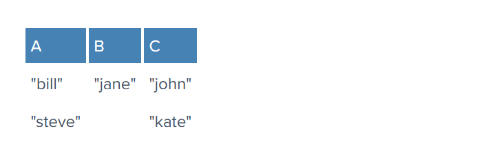

### The following topics i will cover on this topic:


### What is cache?
`In computing, a cache is a hardware or software component that stores data so that future requests for that data can be served faster; the data stored in a cache might be the result of an earlier computation or a copy of data stored elsewhere`
- When a client/server request is made without caching, the client sends a request to the service, which then retrieves data from storage and sends it back to the client. However, retrieving data from storage can become slow and overloaded with high volumes of traffic.
- Adding a cache to the system can help overcome these limitations. When data is requested, the service first checks the cache for the data. If the data is present in the cache, it is quickly returned to the service. If the data is not found in the cache, the service retrieves it from storage, stores it in the cache, and then responds to the client. This allows for faster retrieval of frequently accessed data since cache usually stores data in memory in a data structure optimized for fast access.


- Cache systems and storage systems differ in several ways. First, cache systems store frequently accessed data in memory. Storage systems store data on disks. Since memory is more expensive than disk, cache systems typically have much smaller data capacity than storage systems. This means that cache systems can store only a subset of the total data set.
- Second, the data stored in cache systems are not designed for long-term data persistence and durability. Cache systems are used to improve performance. They do not provide durable data storage. In contrast, storage systems are designed to provide long-term data persistence and durability, ensuring that data is always available when needed.
- Finally, cache systems are optimized for supporting heavy traffic and high concurrency. By storing data in memory, cache servers can respond quickly to incoming requests, which is crucial for high-traffic websites or applications. Storage systems, on the other hand, are better suited for durably storing and managing large amounts of data.
- If the data that is requested is available in the cache, it is known as a cache hit, otherwise, it is known as a cache miss. Because accessing data from the cache is significantly faster than accessing it from storage, the system overall operates more efficiently when there are more cache hits. The effectiveness of a cache is measured by the cache hit ratio, which is the number of cache hits divided by the number of cache requests. Higher ratios indicate better overall performance.
### Why we need cache in our applications?
- One of the primary benefits of caching is improved application performance. By reducing the time it takes to access frequently requested content, web applications can respond to user requests more quickly, improving user experience and overall application performance. Additionally, caching can help reduce the load on web servers and other resources, which can help reduce costs and improve scalability.
- Caching is suitable for frequently accessed data without negatively affecting data integrity or application functionality. Common use cases include serving static assets like images, stylesheets, and scripts, caching database queries or API responses, and caching pages or content for dynamic web apps. `However, consider the caching strategy for each app and regularly refresh or invalidate cached content to avoid serving stale content.`

### Where is caching used

- Modern computers utilize multiple levels of cache, including the L1, L2, and L3 caches, to provide fast access to frequently used data for the CPU.

- The Memory Management Unit (MMU) is responsible for mapping virtual memory addresses to physical memory addresses. The MMU contains a specialized cache called the Translation Lookaside Buffer (TLB), which stores the most recently used address translations to speed up the address translation process.

- The operating system employs a page cache in the main memory to enhance overall system performance. The page cache stores frequently accessed data pages and reduces the number of disk accesses, which can slow down the system.

- By utilizing these different levels of cache, modern computers can improve their overall performance and efficiency.

- In software systems, caching plays a crucial role in enhancing performance and reducing network latency.

- Browsers use a cache to store frequently accessed website images, data, and documents, resulting in faster load times and a smoother browsing experience. This cache is commonly known as the browser cache.

- Content Delivery Networks (CDNs) are another form of caching used to deliver static resources such as images, videos, CSS files, and other multimedia content. CDNs are a geographically distributed network of proxy servers that work together to deliver content from the nearest server to the user's location. This significantly reduces the time taken to access the content, resulting in a faster-loading website.

- Caching in databases is essential for improving performance and reducing execution overhead. Some typical caches found in databases include the buffer cache, result cache, query cache, metadata cache, and session cache. These caches store frequently accessed data blocks, query results, metadata, and session-specific information in memory to reduce disk reads and query execution time, resulting in faster query response times and a better user experience.

- Two widely used caching systems are Memcached and Redis. They are open-source, high-performance, distributed caching systems that can be used to store and retrieve data quickly.

- Real-world use cases for caching include storing historical emails locally to avoid repeatedly pulling the same data from the server, caching popular tweets on social media websites like Twitter, and preloading and caching product information for flash sale systems to prevent excessive database pressure.

- Caching is an effective solution for scenarios where data changes infrequently, the same data is accessed multiple times, the same output is produced repeatedly, or the results of time-consuming queries or calculations are worth caching.
### Cache deployment
Caching is typically classified into three main categories based on where it is
deployed: in-process cache, inter-process cache, and remote cache.

#### In process caches
In-process cache is a type of cache that is located within the application itself. It
provides high read and write performance with zero network cost. However, it has
limited data capacity that is restricted by the memory size, and cached data is lost if
the process restarts. In-process cache can be implemented as a library, such as
Google Guava Cache.


#### Inter-process cache
Inter-process cache, also known as local cache, runs in a separate process on the
local machine. It has fast read and write speed, no network cost, and no data loss
when the application process restarts. However, having the business logic and cache
on the same host can complicate operation and maintenance costs, and cached data
will be lost if the host crashes. Inter-process cache is usually implemented as locally
deployed third-party storage, such as RocksDB, Memcached, and Redis in standalone
mode.


#### Remote cache
Remote cache is deployed on a separate machine from the application, usually
composed of multiple machines deployed together. It offers better scalability, ease of
deployment and maintenance, and the ability to be shared by multiple applications.
However, deploying a remote cache requires dedicated resources such as hardware,
software, etc. Accessing data from a remote cache requires network communication,
which can increase latency and reduce performance. Examples of remote cache
include Memcached and Redis deployed on remote servers.


### Cache replacement and invalidation
- Optimizing cache hits requires anticipating data access patterns and preloading the
cache as much as possible. However, predicting these patterns accurately can be a
challenging task. The principle of locality can be helpful in this regard.
- Temporal locality refers to the tendency for recently accessed data to be accessed
again in the near future. For example, in a social media application, hot tweets are
likely to be frequently accessed.


- Spatial locality, on the other hand, refers to the tendency for data that is close to
recently accessed data to be accessed soon after. For example, in a database, when a
value is taken from a sequence, it is likely that the next values in the sequence will be
accessed later.


- When traffic follows these patterns of locality, cache usage can be optimized, leading
to more cache hits and improved performance. However, the capacity of the cache
also affects its performance. A larger cache capacity allows for more data to be
cached and for the data to remain in the cache for a longer period of time, resulting
in better cache usage. This comes at the cost of increased space requirements and a
tradeoff between space and cost.

### Cache replacement
- In practice, the cache has a limited capacity, so it's not possible to store all of the
data in the cache. The best approach is to store the most frequently accessed data in
the cache in order to maximize its effectiveness.
- There are several cache replacement policies, including the Least Recently Used
(LRU) policy, which discards the least recently used items first based on their last
accessed timestamp. This policy is suitable for caching hot keys. The Least
Frequently Used (LFU) policy, on the other hand, discards the least frequently used
items first based on their usage count. This policy is often used for caching hot
tweets, and is often used in conjunction with LRU to filter the most recent popular
tweets.
- The allowlist policy is another approach, where data items in the allowlist will not be
evicted from the cache. This method is suitable for specific business scenarios with
known hot keys, where popular data items can be identified in advance and
preloaded into the cache.

### Cache invalidation
- Cache invalidation is a crucial process in maintaining data consistency between
storage and cache. When data is modified, updating both storage and cache
simultaneously can be challenging. Cached data may become stale, leading to
incorrect results and potential performance issues. To solve this problem, cache
invalidation techniques are used to remove or refresh stale data in the cache


- The most common cache invalidation strategies are:
  - Invalidation when modifying: This approach involves actively invalidating the
data in cache when the application modifies the data in storage. It is a widely
used technique.
  - Invalidation when reading: With this method, the application checks the validity
of the data when it retrieves it from the cache. If the data is stale, it is read from
the storage and written to the cache. While this approach is flexible, it can add
more complexity to the application.
  - Time-to-live (TTL): The application sets a lifetime for the cached data, and the
data is removed or marked as invalid once the TTL expires. This is a popular
mechanism for managing cache invalidation

### Distributed cache
- A distributed cache stores frequently accessed data in memory across multiple nodes. The cached data is partitioned across many nodes, with each node only storing a portion of the cached data. The nodes store data as key-value pairs, where each key is deterministically assigned to a specific partition or shard. When a client requests data, the cache system retrieves the data from the appropriate node, reducing the load on the backing storage.
> There are different sharding strategies, including modulus, range-based and consistent hashing.
#### Modulus sharding
- Modulus sharding involves assigning a key to a shard based on the hash value of the key modulo the total number of shards. Although this strategy is simple, it can result in many cache misses when the number of shards is increased or decreased. This is because most of the keys will be redistributed to different shards when the pool is resized.
 

#### Range-based sharding
- Range-based sharding assigns keys to specific shards based on predefined key ranges. With this approach, the system can divide the key space into specific ranges and then map each range to a particular shard. Range-based sharding can be useful for certain business scenarios where data is naturally grouped or partitioned in specific ranges, such as geolocation-based data or data related to specific customer segments.


- However, this approach can also be challenging to scale because the number of shards is predefined and cannot be easily changed. Changing the number of shards requires redefining the key ranges and remapping the data.

#### Consistent hashing
- Consistent hashing is a widely-used sharding strategy that provides better load balancing and fault tolerance than other sharding methods. With consistent hashing, the keys and the nodes are both mapped to a fixed-size ring, using a hash function to assign each key and node a position on the ring.


- When a key is requested, the system uses the same hash function to map the key to a position on the ring. The system then traverses the ring clockwise from that position until it reaches the first node. That node is responsible for storing the data associated with the key. Adding or removing nodes from the system only requires remapping the keys that were previously stored on the affected nodes, rather than redistributing all the keys, making it easy to change the number of shards with a limited amount of data rehashed.

<details>
<summary> Read more about: consistent hashing</summary>

### What Is Hashing?
- A hash function is a function that maps one piece of data—typically describing some kind of object, often of arbitrary size—to another piece of data, typically an integer, known as hash code, or simply hash.

- For instance, some hash function designed to hash strings, with an output range of 0 .. 100, may map the string Hello to, say, the number 57, Hasta la vista, baby to the number 33, and any other possible string to some number within that range. Since there are way more possible inputs than outputs, any given number will have many different strings mapped to it, a phenomenon known as collision. Good hash functions should somehow “chop and mix” (hence the term) the input data in such a way that the outputs for different input values are spread as evenly as possible over the output range.

- Hash functions have many uses and for each one, different properties may be desired. There is a type of hash function known as cryptographic hash functions, which must meet a restrictive set of properties and are used for security purposes—including applications such as password protection, integrity checking and fingerprinting of messages, and data corruption detection, among others

### Introducing Hash Tables (Hash Maps)
- Imagine we needed to keep a list of all the members of some club while being able to search for any specific member. We could handle it by keeping the list in an array (or linked list) and, to perform a search, iterate the elements until we find the desired one (we might be searching based on their name, for instance). In the worst case, that would mean checking all members (if the one we’re searching for is last, or not present at all), or half of them on average. In complexity theory terms, the search would then have complexity O(n), and it would be reasonably fast for a small list, but it would get slower and slower in direct proportion to the number of members.

- How could that be improved? Let’s suppose all these club members had a member ID, which happened to be a sequential number reflecting the order in which they joined the club.

- Assuming that searching by ID were acceptable, we could place all members in an array, with their indexes matching their IDs (for example, a member with ID=10 would be at the index 10 in the array). This would allow us to access each member directly, with no search at all. That would be very efficient, in fact, as efficient as it can possibly be, corresponding to the lowest complexity possible, O(1), also known as constant time.

- First, a good hash function generally has a wide output range (typically, the whole range of a 32 or 64-bit integer), so building an array for all possible indices would be either impractical or plain impossible, and a colossal waste of memory. To overcome that, we can have a reasonably sized array (say, just twice the number of elements we expect to store) and perform a modulo operation on the hash to get the array index. So, the index would be index = hash(object) mod N, where N is the size of the array.

- Second, object hashes will not be unique. There will be collisions (further increased by the modulo operation), and therefore a simple direct index access won’t work. There are several ways to handle this, but a typical one is to attach a list, commonly known as a bucket, to each array index to hold all the objects sharing a given index.

- So, we have an array of size N, with each entry pointing to an object bucket. To add a new object, we need to calculate its hash modulo N, and check the bucket at the resulting index, adding the object if it’s not already there. To search for an object, we do the same, just looking into the bucket to check if the object is there. Such a structure is called a hash table, and although the searches within buckets are linear, a properly sized hash table should have a reasonably small number of objects per bucket, resulting in almost constant time access (an average complexity of O(N/k), where k is the number of buckets).

- With complex objects, the hash function is typically not applied to the whole object, but to a key instead. In our club member example, each object might contain several fields (like name, age, address, email, phone), but we could pick, say, the email to act as the key so that the hash function would be applied to the email only. In fact, the key need not be part of the object; it is common to store key/value pairs, where the key is usually a relatively short string, and the value can be an arbitrary piece of data. In such cases, the hash table or hash map is used as a dictionary, and that’s the way some high-level languages implement objects or associative arrays.

### Scaling Out: Distributed Hashing
- In some situations, it may be necessary or desirable to split a hash table into several parts, hosted by different servers. One of the main motivations for this is to bypass the memory limitations of using a single computer, allowing for the construction of arbitrarily large hash tables (given enough servers).
In such a scenario, the objects (and their keys) are distributed among several servers, hence the name.
A typical use case for this is the implementation of in-memory caches, such as Memcached.
#### how does distribution take place? What criteria are used to determine which keys to host in which servers?
- The simplest way is to take the hash modulo of the number of servers. That is, server = hash(key) mod N, where N is the size of the pool. To store or retrieve a key, the client first computes the hash, applies a modulo N operation, and uses the resulting index to contact the appropriate server (probably by using a lookup table of IP addresses). Note that the hash function used for key distribution must be the same one across all clients, but it need not be the same one used internally by the caching servers.
- Let’s see an example. Say we have three servers, A, B and C, and we have some string keys with their hashes:

- A client wants to retrieve the value for key john. Its hash modulo 3 is 2, so it must contact server C. The key is not found there, so the client fetches the data from the source and adds it. The pool looks like this:
- Next another client (or the same one) wants to retrieve the value for key bill. Its hash modulo 3 is 0, so it must contact server A. The key is not found there, so the client fetches the data from the source and adds it. The pool looks like this now:


### The Rehashing Problem
- This distribution scheme is simple, intuitive, and works fine. That is, until the number of servers changes. What happens if one of the servers crashes or becomes unavailable? Keys need to be redistributed to account for the missing server, of course. The same applies if one or more new servers are added to the pool;keys need to be redistributed to include the new servers. This is true for any distribution scheme, but the problem with our simple modulo distribution is that when the number of servers changes, most hashes modulo N will change, so most keys will need to be moved to a different server. So, even if a single server is removed or added, all keys will likely need to be rehashed into a different server.
- From our previous example, if we removed server C, we’d have to rehash all the keys using hash modulo 2 instead of hash modulo 3, and the new locations for the keys would become:


Note that all key locations changed, not only the ones from server C.
In the typical use case we mentioned before (caching), this would mean that, all of a sudden, the keys won’t be found because they won’t yet be present at their new location.
So, `most queries will result in misses, and the original data will likely need retrieving again from the source to be rehashed, thus placing a heavy load on the origin server(s) (typically a database). This may very well degrade performance severely and possibly crash the origin servers.`

### The Solution: Consistent Hashing
- So, how can this problem be solved? We need a distribution scheme that does not depend directly on the number of servers, so that, when adding or removing servers, the number of keys that need to be relocated is minimized. One such scheme—a clever, yet surprisingly simple one—is called consistent hashing
- Consistent Hashing is a distributed hashing scheme that operates independently of the number of servers or objects in a distributed hash table by assigning them a position on an abstract circle, or hash ring. This allows servers and objects to scale without affecting the overall system.
- Imagine we mapped the hash output range onto the edge of a circle. That means that the minimum possible hash value, zero, would correspond to an angle of zero, the maximum possible value (some big integer we’ll call INT_MAX) would correspond to an angle of 2𝝅 radians (or 360 degrees), and all other hash values would linearly fit somewhere in between. So, we could take a key, compute its hash, and find out where it lies on the circle’s edge. Assuming an INT_MAX of 1010 (for example’s sake), the keys from our previous example would look like this:


- Now imagine we also placed the servers on the edge of the circle, by pseudo-randomly assigning them angles too. This should be done in a repeatable way (or at least in such a way that all clients agree on the servers’ angles). A convenient way of doing this is by hashing the server name (or IP address, or some ID)—as we’d do with any other key—to come up with its angle.
- In our example, things might look like this:


- Since we have the keys for both the objects and the servers on the same circle, we may define a simple rule to associate the former with the latter: Each object key will belong in the server whose key is closest, in a counterclockwise direction (or clockwise, depending on the conventions used). In other words, to find out which server to ask for a given key, we need to locate the key on the circle and move in the ascending angle direction until we find a server.


- To ensure object keys are evenly distributed among servers, we need to apply a simple trick: To assign not one, but many labels (angles) to each server. So instead of having labels A, B and C, we could have, say, A0 .. A9, B0 .. B9 and C0 .. C9, all interspersed along the circle. The factor by which to increase the number of labels (server keys), known as weight, depends on the situation (and may even be different for each server) to adjust the probability of keys ending up on each. For example, if server B were twice as powerful as the rest, it could be assigned twice as many labels, and as a result, it would end up holding twice as many objects (on average).
For our example we’ll assume all three servers have an equal weight of 10 (this works well for three servers, for 10 to 50 servers, a weight in the range 100 to 500 would work better, and bigger pools may need even higher weights):


- So, what’s the benefit of all this circle approach? Imagine server C is removed. To account for this, we must remove labels C0 .. C9 from the circle. This results in the object keys formerly adjacent to the deleted labels now being randomly labeled Ax and Bx, reassigning them to servers A and B.

- But what happens with the other object keys, the ones that originally belonged in A and B? Nothing! That’s the beauty of it: The absence of Cx labels does not affect those keys in any way. So, removing a server results in its object keys being randomly reassigned to the rest of the servers, leaving all other keys untouched
</details>

### Caching Strategies
#### Cache-Aside
- In the Cache-Aside caching strategy, the cache is resided next to the database. Here the application is responsible for managing the cache. Whenever the data requests come, the application checks the cache at first. If the asked data is available in the cache, simply return it. Otherwise, data is retrieved from the database and stored in the cache for future usage. It is also called Lazy Loading.
##### Example: Cache-Aside strategy is suitable for e-commerce websites.
- The below image shows the Cache-Aside strategy working mechanism. Consider an e-commerce web application with a large amount of customers.
   - Generally, the e-commerce application requests product details (name, price) more often.
   - Using cache-aside, whenever a customer requests a product page, the application first checks the cache whether it contains product details or not.
   - If the data exists, return the product details from the cache. Otherwise, fetch the product details from the database and store them in the cache.

 

#### Read-Through
- In the Read-Through caching approach, the cache is positioned between the application and the database. Whenever the data requests come, the application goes to the cache first. If the requested data is found, simply return it. Otherwise, the cache fetches the data from the database and then returns it to the application. The cache is responsible for fetching data from the database. It is suitable for applications with read-heavy workload .
##### Example: A Read-Through strategy is preferable for social media platforms.
- The below image shows the Read-Through strategy working mechanism. Assume a social media platform,
When a user login the application, request the user profile details from the cache.
   - If profile details exist, return it.
   - Otherwise, Cache is responsible for fetching user profile details from the DB and storing it in the cache then returning the response to the application.

 

#### Write-Through
- In the Write-Through cache mechanism, the application writes data to the cache and the database simultaneously. Whenever the data is added or updated, that is written to the cache and the database at the time. Also, it reduces read delays, because data is directly fetched from the cache. However, it slows down write operations because of double the time write operation.
##### Example: A Write-Through strategy is suggested for banking applications.
- The below image shows the Write-Through strategy working mechanism. Let's say a banking application, the users frequently perform transactions like deposits and withdrawals.
   - For each transaction application needs to update the user's account balance. So the application writes user account balance details in the cache and cache writes the balance info to the DB immediately.
   - Write-through caching provides consistency between the cache and database. So that users always receive reliable information about their account balances.

 

#### Write-back
- In a Write-Back strategy, the application directly writes the data to the cache at first, then after some delay data is written to the database. It ensures recent data is always present in the cache. So the data is easily accessible. This method is suitable for applications with a write-heavy workload. There is possible to risk of data loss if the cache fails before writing to the database. If the cache is not handled properly, it will lead to data inconsistency between the cache and the database. It is also called Write-Behind.
##### Example: The Write-Back strategy is suitable for the Content Management System (CMS).
- The below image shows the Write-Through strategy working mechanism. Consider a content management system that is used for blogging. Authors frequently add or update their blog posts.
   - The application first writes the content changes to the cache. Then the cache does write operation to the database with delay (for a predefined period).
   - During this delay period, if the author makes further updates to the same blog post, the changes are overwritten by updated content on the cache.

 

#### Write-Around
- Generally, a Write-Around mechanism combines with a Read-Through caching approach or Cache-Aside strategy. The application always writes the data into the database and reads data from the cache. If there's a cache miss, the data is fetched from the database and then stored in the cache for future reads. This strategy works best when data is rarely updated and read in more often.
##### Example: Write-Around strategy is suggested for Cloud Storage Service.
- The below image shows the Write-Around strategy working mechanism. Consider a cloud storage service where users frequently upload large files like videos and images.
   - Whenever the users newly upload files, the system uses a write-around caching strategy to store them on the backend storage without caching them.
   - Similarly, if a user requests to access a file, the system checks the cache first. If the file is found in the cache return it directly. Otherwise fetch the file from the backend storage and return it to the user.

 

#### Cache strategy combinations
- Cache strategies can be combined to create robust and effective caching solutions tailored to specific use cases and requirements. Some of the popular cache strategy combinations include:
  - Cache-aside & write-around: Commonly used in systems such as Memcached and Redis,this combination takes advantage of cache-aside's read capabilities and write-around's simple and efficient write operations.
  - Read-through & write-through: This combination leverages the cache as an intermediary for both read and write operations, ensuring data consistency between cache and storage systems. Examples of this combination include DynamoDB Accelerator (DAX).
  - Read-through & write-back: This combination offers the benefits of read-through for reading data and write-back for efficient write operations. The asynchronous nature of  write-back improves write performance while maintaining data consistency with read-through

#### Conclusion
| Caching Strategies | Advantages | Disadvantages |
| --- | --- | --- |
| Cache-Aside | This approach is efficient for read-heavy workload applications. It allows flexibility in data models compared to the database. | Risk of inconsistency between the cache and database. Data written directly to the database may not immediately reflect in the cache, leading to potential inconsistencies.|
| Read-Through | It simplifies the application logic because the cache handles data retrieval. It is also suitable for read-heavy workload applications. | This approach increases the database load. For every new data request, results are returned from the database instead of the cache. Maintaining the data consistency between the cache and database is complex. |
| Write-Through | Write-through caching ensures data consistency between the cache and database. It supports faster write operations. | This method requires more time for write operations because data should be written in the both cache and the database. Write-through caching is complex because it requires careful coordination between the cache and the database. |
| Write-Back | This caching can improve overall write performance because it reduces the number of write operations to the database. It is suitable for applications with a write-heavy workload. | There's a risk of data loss if the cache fails before writing to the database. While using the Write-back method, there can be data inconsistency occurs between the cache and the database. |
| Write-Around | This caching strategy is mainly used to improve the application and database performance. It prevents cache pollution. Because it efficiently handles the cache. | This method increases the read latency if the cache miss.There is a possible risk of returning outdated information |

### Managing Operational Challenges in Caching
- When implementing caching systems, it is crucial to not only choose the best cache
strategies but also address the operational challenges that may arise. The following
section dives into common caching problems by category and provides insight into
how to tackle these challenges effectively.
#### Reliability Challenges
- Cache reliability is important for maintaining stable system performance. Common
reliability issues include cache avalanche, cache stampede, and cache penetration.
#### Mitigating cache avalanche and cache stampede
- Caching systems play a crucial role in protecting databases by maintaining high
cache hit ratios and reducing traffic to storage systems. Under normal conditions,
most read requests result in cache hits, with only a small portion leading to cache
misses. By design, the cache handles the majority of the traffic, and the storage
system experiences significantly less load.
- Cache avalanche and cache stampede are related but distinct phenomena that can
occur in large scale systems, causing significant performance degradation or even
system-wide outages. 
> Cache avalanche happens when multiple or all cache entries
expire simultaneously or within a short time window, leading to a sudden surge in
requests to the underlying data store.
 

> Cache stampede, also known as thundering herd, occurs in large scale systems when
a sudden influx of requests overwhelms the system, causing performance degradation
or even system-wide outages. This can happen due to various reasons, such as cache
misses on popular items, a sudden spike in user traffic, or service restarts after
maintenance.
 

- When a cache or part of it fails, a large number of read requests result in cache misses, causing a massive influx of traffic to the storage system. This sudden increase in traffic can significantly reduce storage performance or even lead to system crashes. In this scenario, the failure of the cache serves as a trigger that combines elements of both cache avalanche and cache stampede,resulting in a high-stress situation for the storage system.
- Traffic peaks, such as during high-traffic events like Black Friday sales on ecommerce sites in the United States, can also trigger these phenomena. A single cache node might crash due to the increased demand for popular keys, causing these keys to be rehashed to another node, which then crashes as well, eventually leading to the collapse of the entire cache system.
- To maintain the stability and efficiency of large scale systems, it is essential to implement strategies that mitigate the risks of both cache avalanche and cache stampede. There are  several techniques to help prevent and alleviate the impact of these events.
#### Staggered expiration
- For cache avalanche prevention, use staggered expiration by combining a base timeto-live (TTL) value with a random delta. This approach spreads out the expiration
times of cached entries, reducing the likelihood of many items expiring at once.
 

#### Consistent hashing
- Consistent hashing can be used to distribute cache entries across multiple cache
servers evenly. This technique reduces the impact of cache avalanche and cache
stampede by sharing the load among the remaining servers and preventing a single
point of failure.

#### Circuit breaker
- Implementing circuit breakers in the system can help prevent cache avalanche and
cache stampede from escalating into more severe issues. Circuit breakers monitor
the system's health and prevent overloading by stopping excessive requests to the
cache and data store if the system is under high stress.

#### Rate limit and load shedding
- Employing request rate limiting and load shedding(Drop or defer lower-priority requests when system is under heavy load to protect critical services.) can specifically address cache stampede by controlling the rate at which requests are processed and preventing the system from being overwhelmed. These techniques can be applied on a per-user, perclient, or system-wide basis to maintain stability during high-load situations.

### Cache penetration
- Cache penetration occurs when an application attempts to access non-existent data, bypassing the cache and leading to potential performance issues. When an application requests a non-existent key, it results in a cache miss, followed by a request to the storage system, which also returns an empty result. This bypassing of
the cache to reach the backing storage is referred to as cache penetration. If a large number of non-existent key requests occur, it can impact the performance of the storage layer and destabilize the overall system.
 
 
- A common example of cache penetration occurs when numerous users try to query
non-existent orders on a website within a short period. Large websites typically
implement protective measures to mitigate this issue.
- To mitigate this, store a placeholder value in the cache to represent non-existent
data. Subsequent requests for the same non-existent data will hit the cache instead of
the data store. Set an appropriate TTL for these placeholder entries to prevent them
from occupying cache space indefinitely.
 

- While this method is simple and effective, it can consume significant cache resources
if the application frequently queries a large number of non-existent keys.
Another solution involves using a bloom filter, a space-efficient, probabilistic data
structure that tests whether an element belongs to a set. By using a bloom filter, the
system can quickly identify non-existent data, reducing cache penetration and
unnecessary data store requests.
- When a record is added to storage, its key is also recorded in a bloom filter.  When
fetching a record, the application first checks whether the key exists in the bloom
filter. If the key is absent, it won't exist in the cache or storage either, and the
application can return a null value directly. If the key is present in the bloom filter,
the application proceeds to read the key from the cache and storage as usual. Since a
bloom filter sometimes returns a false positive, a small number of the cache reads
will result in a cache miss.
 

- The challenge of using a bloom filter lies in its capacity limitations. For instance, 1
billion keys with a 1% false positive rate would require approximately 1.2 GB of
capacity. This solution is best suited for smaller data sets.

### Traffic Pattern Challenges
#### Hot key problems
- The hot key problem occurs when high traffic on a single key results in excessive
traffic pressure on the cache node, potentially leading to performance issues.
- In a distributed cache system, keys are shared across different nodes based on a
sharding strategy. Traffic for each key can vary greatly, with some keys experiencing
exceptionally high traffic. As illustrated in the diagram below, substantial traffic for
keys like "key12" and "key15" could potentially exceed the resource capacity of node
1.
- For instance, when tweets are distributed in the cache system by their IDs, and a few
of them become popular quickly, the corresponding cache node experiences
increased traffic, possibly surpassing its resource capabilities. Hot key issues can
arise in various scenarios, such as operational emergencies, festivals, sports games,
flash sales, etc.
 

- To address this problem, two steps are necessary:
1. Identify the hot keys.
2. Implement special measures for these keys to reduce traffic pressure.

- [x] In step 1, for predictable events like important holidays or online promotions, it is possible to evaluate potential hot keys beforehand. However, for emergencies, advance evaluation is not feasible. One solution is to conduct real-time traffic analysis to promptly detect emerging hot keys.
- [x] In step 2, there are several potential solutions:
Distribute traffic pressure across the entire cache system. As illustrated in the diagram below, split "key12" into "key12-1", "key12-2", up to "key12-N", and distribute these N keys across multiple nodes. When an application requests a hot key, it randomly selects one of the suffixed keys, enabling traffic to be shared across many nodes and preventing a single node from becoming overloaded.
 

- If numerous hot keys exist, real-time monitoring can enable the cache system to expand quickly, reducing the traffic impact.
- As a last resort, applications can store hot keys in a local cache, decreasing traffic to the remote cache system. This approach alleviates the pressure on the cache nodes and helps maintain overall system performance.

#### Large key problem
- When the value size of a key is significantly large, it can result in access timeouts, leading to the large key problem.
- The impact of the large key problem is more severe than it may initially seem:
  - Frequent access to large keys can consume significant network bandwidth, leading to slow lookup performance.
  - Any partial update of a large key will result in the modification of the entire value, further contributing to performance issues.
  - If a large key becomes invalid or is evicted from the cache, reloading it from storage can be time-consuming, leading to additional slow query performance.
 

- Large keys are encountered in specific scenarios. For example, the content of some social media posts may be much larger than average, and accessing these larger posts will naturally take more time
- Several methods can be employed to address the large key problem:
  - Compress large keys in cache to reduce data size.
  - Set a longer Time-To-Live (TTL) for large keys to minimize eviction or invalidation.
  - Divide large keys into multiple smaller ones to minimize the presence of large keys in the system.
  - Prevent the creation of large keys by modifying business requirements, such as limiting the length of tweets. This approach helps to avoid the large key problem from the outset.

### Consistency Challenge
- Cache consistency is a crucial aspect of any caching system, involving two primary concerns:
  - Consistency within the cache system itself.
  - Consistency between the cache and the underlying data storage
 

- Cache consistency is defined as follows: if a key exists in the cache, its value should eventually match the value in the underlying data store.
- To optimize performance, caching systems make trade-offs between consistency and speed. The best achievable consistency in these systems is eventual consistency, where the cache and storage eventually have the same data.
- There are several scenarios that could lead to cache inconsistency

#### Cache system without replicas
- In a cache system without replicas, each shard of cache data has just one copy stored in a single cache node, typically in memory for improved performance. When the cache process or node restarts, all cached keys are cleared, causing requests for these keys to result in cache misses. Memcached is an example of such a system. To prevent data loss from memory, disk backup can in theory be employed. With disk backup, memory can be recovered after the cache process restarts. Disk backup can be implemented using either a write-through or write-back strategy, each with its pros and cons.
  - Write-through strategy: In this approach, any memory update also updates the disk synchronously. Data consistency between memory and disk is guaranteed, but at the cost of reduced write performance.
  - Write-back strategy: This method updates the disk asynchronously in batches after the memory is updated. While it generally offers better performance since caching systems prioritize speed, the write-back cache acknowledges write requests before writing to the disk, which may cause data loss if a crash occurs during this process.
  - Modified write-back strategy: An alternative write-back strategy acknowledges write requests only after writing to the disk. If upstream clients don't receive a timely response, they can retry, preventing data loss. However, this approach increases the response time for a single write across the entire batch of writes. The period of batch writing is a critical factor, and with an appropriate duration, this strategy can be an effective choice

- In practice, restoring a large cache with a vast amount of data from disk after a crash can take too long to be practical. This is why disk backup strategies are rarely used, even with products like Redis that offer persistence. In most situations, cache replicas are a more efficient and reliable approach for ensuring data durability and fault tolerance.

#### Multiple cache replicas
- In a distributed cache system with more than one replica for cached data, the system can tolerate the crash of a single node. However, this introduces the complexity of ensuring consistency among different replicas for the same cached key. This issue is fundamentally about data consistency in a distributed system. As previously mentioned, caching systems typically prioritize speed, making strict consistency difficult to achieve.
- When writing a key to a cache with multiple replicas, there are several approaches:
  - Parallel writing to all replicas: The application writes to all replicas in parallel, waiting for responses from each. Response time is determined by the slowest replica, but if any single replica is unreachable, the write process is blocked.
  - Writing to a quorum of replicas: This improved method writes to more than half of the replicas, but it introduces additional complexity and must be combined with a quorum-based read process. Generally, it is not worth implementing such a complex mechanism for cache replicas.
  - Writing to the leader replica: In this approach, data is written only to the leader replica and is then asynchronously replicated to the followers. This popular choice can result in reading stale data from follower replicas if they are not in
  sync with the leader. However, this method works well in scenarios with infrequent or no data updates.
   

#### Writing order of cache and storage
- The cache and storage are typically separate systems, and it is highly unlikely that both can be updated simultaneously. Distributed transactions may be an option, but they require both systems to support transactional operations and often result in
poor performance, making them an impractical choice.
- Consequently, the writing order to the cache and storage significantly impacts their data consistency. There are two main approaches.
  - Writing to the cache first, then to storage: As illustrated below, data is written to the cache before storage. If the application fails before writing to storage, the cache will contain extra data not present in the durable storage. This situation
can negatively affect system behavior, as the extra cached data should not be visible.
  
  - Writing to storage first, then to the cache: As shown below, data is written to storage before the cache. If the application fails before writing to the cache, no harm is done if the cache does not contain the key. However, if the key was already cached, the cached value becomes stale.
  
- Both writing orders can result in data inconsistency between cache and storage, with the latter generally being safer in most scenarios. For the latter, there is an option to invalidate the cache entry first before writing to the storage. This would eliminate the data inconsistency, but it may not work well for hot keys

#### Concurrent cache updates
- Data inconsistency can occur when multiple writers update the cache concurrently,
as illustrated in the following example:

1. Thread A reads a key from the cache, resulting in a cache miss.
2. Thread A falls back to read from storage, and gets the value 1, and prepares to
write the value back to the cache.
3. Thread B writes a new value 2 for the key into storage.
4. Thread B updates the key with new value 2 in cache or invalidates the key (either
option yields the same result).
5. Thread A writes the initially read value 1 back to the cache, creating an
inconsistency between the cache and storage.
- This classic problem arises from multiple writers updating the cache. Both the read and write paths can update the cache, which increases the complexity of the problem.
- Using a distributed lock is an option, but it adds a heavy workload to the reading process and is not ideal. The CAS (compare and swap) mechanism is a better alternative. When reading from the cache, the application retrieves the value along with a version number that increments upon value changes. Writing back to the cache requires the previously read version number, and the value is successfully written only if the version number matches the current one in the cache.
```py
-- KEYS[1] = key
-- ARGV[1] = expected_version
-- ARGV[2] = new_value

local current_version = redis.call("HGET", KEYS[1], "version")
if current_version == ARGV[1] then
    redis.call("HSET", KEYS[1], "value", ARGV[2])
    redis.call("HINCRBY", KEYS[1], "version", 1)
    return "OK"
else
    return "VERSION_MISMATCH"
end
```
- Reserving a dedicated version number for each key demands significant extra capacity, while using a global version number for all keys increases the probability of write failure due to frequent updates. A balanced approach involves maintaining a version number for each shard of keys, requiring minimal space while maintaining an acceptable write failure rate. This approach does, however, introduce complexity

#### Handling Data Inconsistency in Distributed Cache Systems with Consistent Hashing
- In distributed cache systems, consistent hashing is a widely used sharding strategy. When a cache node fails, the data partitions on it are automatically rehashed to other nodes. However, this flexible mechanism can also lead to data inconsistencies, as
shown in the following example:
   - Initially, cache node-1 stores k1, and node-2 stores k2.
   - Node-1 fails, and k1 is rehashed to node-2, where it is loaded upon request.
   - Node-1 restarts, and k1 is rehashed back to node-1, but k1's value in node-2 remains.
   - k1's value is updated, affecting only node-1 and storage.
   - Node-1 fails again, and k1 is rehashed back to node-2, where the previouslyloaded value is still valid, causing data inconsistency between cache node-2 andstorage.


- This issue arises from a node's repeated failures and restarts and updates that affect only one node, leading to dirty data in other nodes. Several solutions can help address this problem or minimize its impact:
   - Shorten the TTL (time-to-live) of cached data, allowing it to expire sooner and be reloaded from storage.
   - Disable the automatic rehash function to prevent dirty data in the cache. In this case, standby nodes should automatically take over failed nodes to avoid cache avalanches.
```sql
-- Force a Full Resynchronization
-- If you're using Redis Sentinel, configure automatic data sync when a node rejoins.
-- If you're using Redis Cluster, ensure that the full sync process occurs when the failed node rejoins the cluster, retrieving fresh data from active nodes.
```
   - If the automatic rehash function remains enabled, find a way to eliminate or invalidate dirty data. However, this approach can be complex and may not be worth the effort.

### Production and operational considerations
#### Monitoring & alerting
- Effective monitoring and alerting are essential for maintaining a healthy caching system. By continuously tracking key metrics and receiving timely alerts, we can quickly identify and address issues before they escalate. Consider the following best
practices
### Caching glossary
- Cache pollution: happens when rarely used or infrequently accessed data enters the cache and pushes out frequently accessed ("hot") data. This reduces the cache's efficiency and can degrade performance.
```
So how does write-around help?
By not caching every write, especially data that might not be read again soon, it avoids polluting the cache with cold data.
This leaves room for frequently read data to stay in the cache longer, improving hit rates and performance.
It’s especially effective when your system writes a lot of data that isn’t immediately read.
```