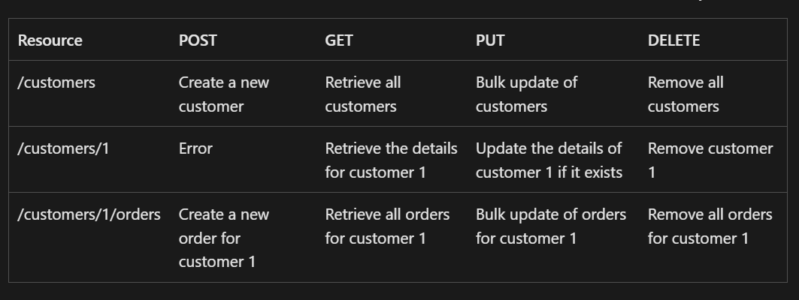
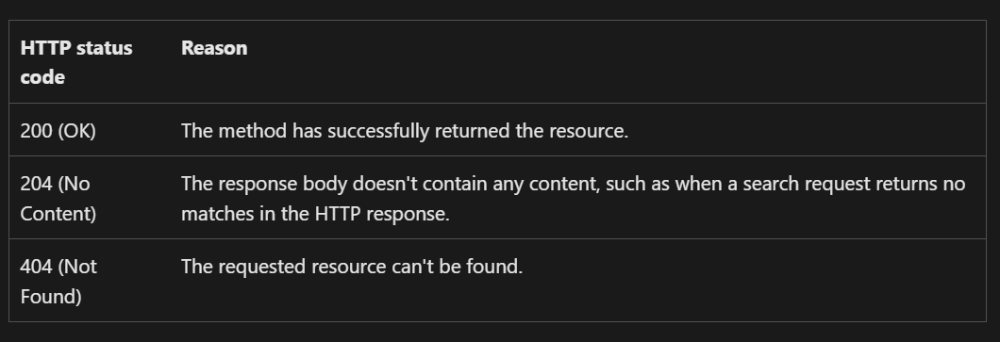
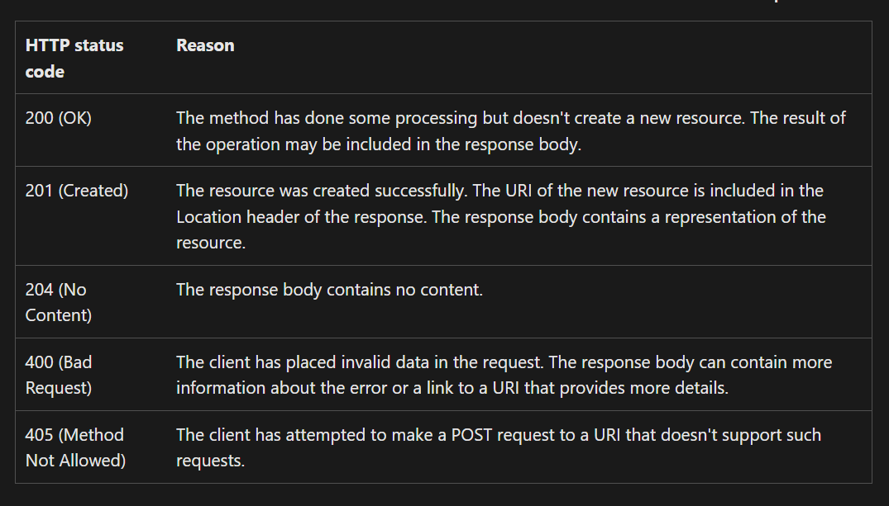
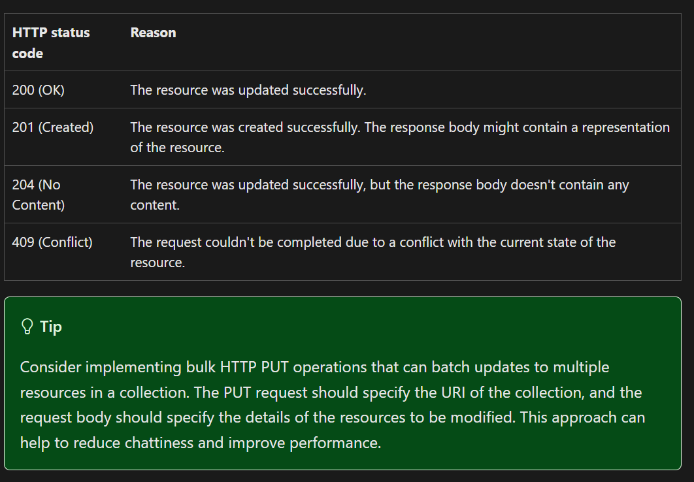
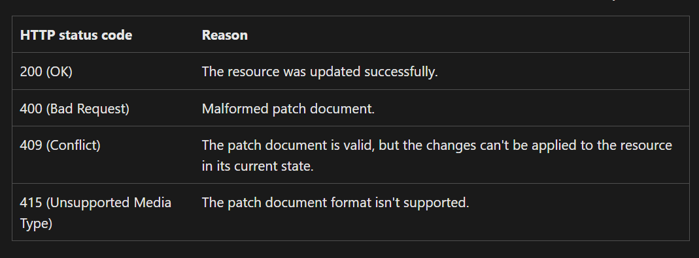
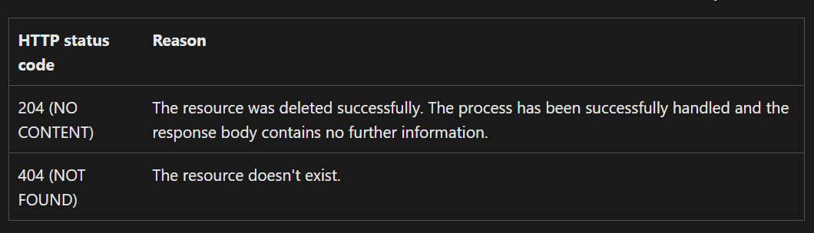

### RestFul API
- APIs play an important role in the communication between different software systems. Traditional methods of doing this were often complicated, slow, and hard to grow. RESTful APIs solve these problems by offering a simple, fast, and scalable way for systems to communicate using standard web protocols like HTTP.
- A RESTful API (Representational State Transfer) is a type of web service that follows the principles of REST. It allows communication between a client and a server over HTTP. RESTful APIs are widely used in web development to build scalable and efficient systems. They are designed around stateless operations, allowing clients and servers to interact.
#### RESTful web API design concepts
To implement a RESTful web API, you need to first understand the following concepts:
- Uniform Resource Identifier (URI). REST APIs are designed around resources, which are any kind of object, data, or service that can be accessed by the client. Each resource should be represented by a URI that uniquely identifies that resource. For example, the URI for a particular customer order might be:
```
https://api.contoso.com/orders/1
```
- Resource representation is how a resource - identified by its URI - is encoded and transported over the HTTP protocol in a specific format, such as XML or JSON. Clients that want to retrieve a specific resource, must use the resource's URI in the request to the API. The API, in response, returns a resource representation of the data indicated by the URI. For example, a client can make a GET request to the URI identifier https://api.contoso.com/orders/1 in order to receive the following JSON body:
```json
{"orderId":1,"orderValue":99.9,"productId":1,"quantity":1}
```
- Uniform interface is used by RESTful APIS to achieve loose coupling of between client and service implementations. For REST APIs built on HTTP, the uniform interface includes using standard HTTP verbs to perform operations on resources such as GET, POST, PUT, PATCH, and DELETE.
- Stateless request model. RESTful APIs use a stateless request model, which means that HTTP requests are independent and might occur in any order. For this reason, keeping transient state information between requests isn't feasible. The only place where information is stored is in the resources themselves, and each request should be an atomic operation. A stateless request model supports high scalability, as there's no need to retain any affinity between clients and specific servers. However, the stateless model can also limit scalability, due to challenges with web service backend storage scalability.
- Hypermedia links. REST APIs can be driven by hypermedia links that are contained in each resource representation. For example, the following shows a JSON representation of an order. It contains links to get or update the customer that's associated with the order.
```json
{
  "orderID":3,
  "productID":2,
  "quantity":4,
  "orderValue":16.60,
  "links": [
    {"rel":"product","href":"https://api.contoso.com/customers/3", "action":"GET" },
    {"rel":"product","href":"https://api.contoso.com/customers/3", "action":"PUT" }
  ]
}
```
#### Define RESTful web API resource URIs
- A RESTful web API is organized around resources. To organize your API design around resources, define resource URIs that map to the business entities. When possible, resource URIs should be based on nouns (the resource) and not verbs (the operations on the resource).
- For example, in an e-commerce system, the primary business entities might be customers and orders. To create an order, a client sends the order information in an HTTP POST request to the resource URI. The HTTP response to the request indicates whether the order creation is successful.
- The URI for creating the order resource could be something like:
```
https://api.contoso.com/orders // Good
```
- Avoid using verbs in URIs to represent operations. For example, the following URI isn't recommended:
```
https://api.contoso.com/create-order // Avoid
```
- Once the client retrieves the collection, it can then make a GET request to the URI of each item. For example, to receive information on a specific order, the client would perform an HTTP GET on the URI https://api.contoso.com/orders/1 to receive the following JSON body as a resource representation of the internal order data:
```json
{"orderId":1,"orderValue":99.9,"productId":1,"quantity":1}
```
#### Resource URI naming conventions
- When designing a RESTful web API, it's important that you use the correct naming and relationship conventions for resources:
    - Use nouns for resource names. Use nouns to represent resources. For example, use /orders instead of /create-order. The verbal action on a URI is already implied by the HTTP GET, POST, PUT, PATCH, and DELETE methods.

    - Use plural nouns to name collection URIs. In general, it helps to use plural nouns for URIs that reference collections. It's a good practice to organize URIs for collections and items into a hierarchy. For example, /customers is the path to the customer's collection, and /customers/5 is the path to the customer with ID equal to 5. This approach helps to keep the web API intuitive. Also, many web API frameworks can route requests based on parameterized URI paths, so you could define a route for the path /customers/{id}.

    - Consider the relationships between different types of resources and how you might expose these associations. For example, the /customers/5/orders might represent all of the orders for customer 5. You could also go in the other direction, and represent the association from an order back to a customer with a URI such as /orders/99/customer. However, extending this model too far can become cumbersome to implement. A better solution is to provide navigable links to associated resources in the body of the HTTP response message. This mechanism is described in more detail in the section Use HATEOAS to enable navigation to related resources.

    - Keep relationships simple and flexible. In more complex systems, it can be tempting to provide URIs that allow the client to navigate through several levels of relationships, such as /customers/1/orders/99/products. However, this level of complexity can be difficult to maintain and is inflexible if the relationships between resources change in the future. Instead, try to keep URIs relatively simple. Once an application has a reference to a resource, it should be possible to use this reference to find items related to that resource. The preceding query can be replaced with the URI /customers/1/orders to find all the orders for customer 1, and then /orders/99/products to find the products in this order.

    - Avoid a large number of small resources. All web requests impose a load on the web server. The more requests, the bigger the load. Therefore, try to avoid "chatty" web APIs that expose a large number of small resources. Such an API might require a client application to send multiple requests to find all of the data that it requires. Instead, you might want to denormalize the data and combine related information into bigger resources that can be retrieved with a single request. However, you still need to balance this approach against the overhead of fetching data that the client doesn't need. Retrieving large objects can increase the latency of a request and incur more bandwidth costs.

    - Avoid creating APIs that mirror the internal structure of a database. The purpose of REST is to model business entities and the operations that an application can perform on those entities. A client shouldn't be exposed to the internal implementation. For example, if your data is stored in a relational database, the web API doesn't need to expose each table as a collection of resources. In fact, that's increasing the attack surface and might lead to data leakage. Instead, think of the web API as an abstraction of the database. If necessary, introduce a mapping layer between the database and the web API. That way, client applications are isolated from changes to the underlying database scheme.
> Avoid requiring resource URIs more complex than collection/item/collection.
> It might not be possible to map every operation implemented by a web API to a specific resource. You can handle such nonresource scenarios through HTTP requests that invoke a function and return the results as an HTTP response message. For example, a web API that implements simple calculator operations such as add and subtract could provide URIs that expose these operations as pseudo resources and use the query string to specify the parameters required. For example, a GET request to the URI /add?operand1=99&operand2=1 would return a response message with the body containing the value 100. However, only use these forms of URIs sparingly.

#### Define RESTful web API methods
##### HTTP request methods
- The HTTP protocol defines many request methods that indicate the desired action to be performed on a resource. The most common methods used in RESTful web APIs are: GET, POST, PUT, PATCH, and DELETE. Each method corresponds to a specific operation. When designing a RESTful web API, you should use these methods in a way that is consistent with the protocol definition, the resource being accessed, and the action being performed.
- It's important to remember that the effect of a specific request method should depend on whether the resource is a collection or an individual item. The following table includes some conventions that are commonly adopted by most RESTful implementations.


##### GET requests
- A GET request retrieves a representation of the resource at the specified URI. The body of the response message contains the details of the requested resource.
- A GET request should return one of the following HTTP status codes:


##### Post requests
- A POST request should create a resource. The server assigns a URI for the new resource, and returns that URI to the client.
- In a RESTful model, POST requests are generally used to add a new resource to the collection identified by the URI. However, a POST request can also be used to submit data for processing to an existing resource, without any new resource being created.
- A POST request should return one of the following HTTP status codes:


##### PUT request
- A PUT request should update an existing resource if it exists or, in some cases, create a new resource if it doesn't exist. The process of making a PUT request is as follows:
   - The client specifies the URI for the resource and includes request body that contains a complete representation of the resource.
   - The client makes the request.
   - If a resource with this URI already exists, it is replaced. Otherwise a new resource is created, if the route supports doing so.
- PUT methods are usually applied to resources that are individual items, such as a specific customer, rather than collections. A server might support updates but not creation via PUT. Whether to support creation via PUT depends on whether the client can meaningfully and reliably assign a URI to a resource before it exists. If not, then use POST to create resources and have the server assign the URI, then use PUT or PATCH to update.
`PUT requests must be idempotent. If a client submits the same PUT request multiple times, the results should always be the same (the same resource will be modified with the same values). POST and PATCH requests are not guaranteed to be idempotent.`
- A PUT request should return one of the following HTTP status codes:


##### PATCH requests
- A PATCH request performs a partial update to an existing resource. The client specifies the URI for the resource. The request body specifies a set of changes to apply to the resource. This can be more efficient than using PUT, because the client only sends the changes, not the entire representation of the resource. 
- With a PATCH request, the client sends a set of updates to an existing resource, in the form of a patch document. The server processes the patch document to perform the update. The patch document doesn't describe the whole resource, only a set of changes to apply. The specification for the PATCH method (RFC 5789) doesn't define a particular format for patch documents. The format must be inferred from the media type in the request.
- JSON is probably the most common data format for web APIs. There are two main JSON-based patch formats, called JSON patch and JSON merge patch.
- JSON merge patch is somewhat simpler. The patch document has the same structure as the original JSON resource, but includes just the subset of fields that should be changed or added. In addition, a field can be deleted by specifying null for the field value in the patch document. (That means merge patch isn't suitable if the original resource can have explicit null values.)
For example, suppose the original resource has the following JSON representation:
```json
{
    "name":"gizmo",
    "category":"widgets",
    "color":"blue",
    "price":10
}
```
Here's a possible JSON merge patch for this resource:
```json
{
    "price":12,
    "color":null,
    "size":"small"
}
```
- This tells the server to update price, delete color, and add size, while name and category are not modified. For the exact details of JSON merge patch, see RFC 7396. The media type for JSON merge patch is application/merge-patch+json.
- Merge patch isn't suitable if the original resource can contain explicit null values, due to the special meaning of null in the patch document. Also, the patch document doesn't specify the order that the server should apply the updates, which might not matter, depending on the data and the domain. JSON patch, defined in RFC 6902, is more flexible, as it specifies the changes as a sequence of operations to apply. Operations include add, remove, replace, copy, and test (to validate values). The media type for JSON patch is application/json-patch+json.
- A PATCH request should return one of the following HTTP status codes:


##### DELETE requests
- A DELETE request removes the resource at the specified URI.
- A DELETE request should return one of the following HTTP status codes:


#### Resource MIME types
- As stated in RESTful web API design concepts, resource representation is how a resource - identified by URI - is encoded and transported over the HTTP protocol in a specific format, such as XML or JSON. Clients that want to retrieve a specific resource, must use the URI in the request to the API. The API, in response, returns a resource representation of the data indicated by the URI.
- In the HTTP protocol, resource representation formats are specified through the use of media types, also called MIME types. For nonbinary data, most web APIs support JSON (media type = application/json) and possibly XML (media type = application/xml).
- The Content-Type header in a request or response specifies the resource representation format. Here's an example of a POST request that includes JSON data:
```
POST https://api.contoso.com/orders
Content-Type: application/json; charset=utf-8
Content-Length: 57

{"Id":1,"Name":"Gizmo","Category":"Widgets","Price":1.99}
```
- If the server doesn't support the media type, it should return HTTP status code 415 (Unsupported Media Type).
- A client request can include an Accept header that contains a list of media types the client accepts from the server in the response message. For example:
```
GET https://api.contoso.com/orders/2
Accept: application/json, application/xml
```
- If the server can't match any of the media types listed, it should return HTTP status code 406 (Not Acceptable).

#### Implement asynchronous methods
- Sometimes a POST, PUT, PATCH, or DELETE method might require processing that takes a while to complete. If you wait for completion before sending a response to the client, it might cause unacceptable latency. If so, consider making the method asynchronous. An asynchronous method should return HTTP status code 202 (Accepted) to indicate the request was accepted for processing but isn't completed.
- You should expose an endpoint that returns the status of an asynchronous request, so the client can monitor the status by polling the status endpoint. Include the URI of the status endpoint in the Location header of the 202 response. For example:
```
HTTP/1.1 202 Accepted
Location: /api/status/12345
```
- If the client sends a GET request to this endpoint, the response should contain the current status of the request. Optionally, it could also include an estimated time to completion or a link to cancel the operation.
```
HTTP/1.1 200 OK
Content-Type: application/json

{
    "status":"In progress",
    "link": { "rel":"cancel", "method":"delete", "href":"/api/status/12345" }
}
```
- If the asynchronous operation creates a new resource, the status endpoint should return status code 303 (See Other) after the operation completes. In the 303 response, include a Location header that gives the URI of the new resource:
```
HTTP/1.1 303 See Other
Location: /api/orders/12345
```

#### Implement data pagination and filtering
- To optimize data retrieval and reduce payload size, implement data pagination and query-based filtering in your API design. These techniques allow clients to request only the subset of data they need, improving performance and reducing bandwidth usage.
- Pagination divides large datasets into smaller, manageable chunks. Use query parameters to specify the number of items to return (limit) and the starting point (offset). Make sure to also provide meaningful defaults for limit and offset (e.g., limit=25, offset=0). For example:
```
GET /orders?limit=25&offset=50
```
> limit: Specifies the maximum number of items to return.
> offset: Specifies the starting index for the data.

<details>
<summary> Read more about: Denial of Service attacks</summary>

#### Denial of Service attacks
- An attack that bypasses pagination limits to query for and process large SQL results sets from the database backing the site. This causes performance degradation as the webserver tries to process the result set and regenerate an HTML page. 
#### Solution
- To help prevent Denial of Service attacks, consider imposing an upper limit on the number of items returned. For example, if your service sets max-limit=25 and a client requests limit=1000, your service could either return 25 items or an HTTP BAD-REQUEST error, if the API is documented as such.
</details>

- Filtering allows clients to refine the dataset by applying conditions. The API can allow the client to pass filter in the query string of the URI:
    - minCost: Filters orders with a minimum cost of 100.
    - status: Filters orders with a specific status.
```
GET /orders?minCost=100&status=shipped
```
Also consider the following best practices:
- Sorting: Allow clients to sort data using a sort parameter (e.g., sort=price).
`The sorting approach can have a negative effect on caching, because query string parameters form part of the resource identifier used by many cache implementations as the key to cached data.`
- Field selection for client-defined projections: Enable clients to specify only the fields they need by using a fields parameter (e.g., fields=id,name). For example, you could use a query string parameter that accepts a comma-delimited list of fields, such as /orders?fields=ProductID,Quantity.
Ensure your API validates the requested fields to ensure they are specifically allowed to be accessed by the client and wouldn't expose fields normally not available through the API.

#### Support partial responses
- Some resources contain large binary fields, such as files or images. To overcome problems caused by unreliable and intermittent connections and to improve response times, consider supporting the partial retrieval of large binary resources.
- To support partial responses, the web API should support the Accept-Ranges header for GET requests for large resources. This header indicates that the GET operation supports partial requests. The client application can submit GET requests that return a subset of a resource, specified as a range of bytes.
- Also, consider implementing HTTP HEAD requests for these resources. A HEAD request is similar to a GET request, except that it only returns the HTTP headers that describe the resource, with an empty message body. A client application can issue a HEAD request to determine whether to fetch a resource by using partial GET requests. For example:
```
HEAD https://api.contoso.com/products/10?fields=productImage
```
Here's an example response message:
```
HTTP/1.1 200 OK

Accept-Ranges: bytes
Content-Type: image/jpeg
Content-Length: 4580
```
- The Content-Length header gives the total size of the resource, and the Accept-Ranges header indicates that the corresponding GET operation supports partial results. The client application can use this information to retrieve the image in smaller chunks. The first request fetches the first 2,500 bytes by using the Range header:
```
GET https://api.contoso.com/products/10?fields=productImage
Range: bytes=0-2499
```
- The response message indicates that this is a partial response by returning HTTP status code 206. The Content-Length header specifies the actual number of bytes returned in the message body (not the size of the resource), and the Content-Range header indicates which part of the resource this is (bytes 0-2499 out of 4580):
```
HTTP/1.1 206 Partial Content

Accept-Ranges: bytes
Content-Type: image/jpeg
Content-Length: 2500
Content-Range: bytes 0-2499/4580

[...]
```
- A subsequent request from the client application can retrieve the remainder of the resource.
##### Example: Handling Partial Responses in ASP.NET Core
```c#
[HttpGet("file")]
public async Task<IActionResult> GetFile()
{
    var filePath = "path/to/your/file.mp4";
    var fileStream = new FileStream(filePath, FileMode.Open, FileAccess.Read);
    
    var request = Request;
    if (request.Headers.ContainsKey("Range"))
    {
        var rangeHeader = request.Headers["Range"].ToString();
        var range = rangeHeader.Replace("bytes=", "").Split('-');
        long start = long.Parse(range[0]);
        long end = range.Length > 1 && !string.IsNullOrEmpty(range[1]) ? long.Parse(range[1]) : fileStream.Length - 1;

        fileStream.Seek(start, SeekOrigin.Begin);
        var buffer = new byte[end - start + 1];
        await fileStream.ReadAsync(buffer, 0, buffer.Length);

        Response.Headers.Add("Content-Range", $"bytes {start}-{end}/{fileStream.Length}");
        Response.Headers.Add("Accept-Ranges", "bytes");
        Response.StatusCode = 206; // Partial Content

        return File(buffer, "video/mp4");
    }

    return File(fileStream, "video/mp4");
}
```
#### Implement HATEOAS (Hypertext as the Engine of Application State)
One of the primary motivations behind REST is that it should be possible to navigate the entire set of resources without requiring prior knowledge of the URI scheme. Each HTTP GET request should return the information necessary to find the resources related directly to the requested object through hyperlinks included in the response, and it should also be provided with information that describes the operations available on each of these resources. This principle is known as HATEOAS, or Hypertext as the Engine of Application State. The system is effectively a finite state machine, and the response to each request contains the information necessary to move from one state to another. No other information should be necessary.
For example, to handle the relationship between an order and a customer, the representation of an order could include links that identify the available operations for the customer of the order. Here's a possible representation:
```json
{
  "orderID":3,
  "productID":2,
  "quantity":4,
  "orderValue":16.60,
  "links":[
    {
      "rel":"customer",
      "href":"https://api.contoso.com/customers/3",
      "action":"GET",
      "types":["text/xml","application/json"]
    },
    {
      "rel":"customer",
      "href":"https://api.contoso.com/customers/3",
      "action":"PUT",
      "types":["application/x-www-form-urlencoded"]
    },
    {
      "rel":"customer",
      "href":"https://api.contoso.com/customers/3",
      "action":"DELETE",
      "types":[]
    },
    {
      "rel":"self",
      "href":"https://api.contoso.com/orders/3",
      "action":"GET",
      "types":["text/xml","application/json"]
    },
    {
      "rel":"self",
      "href":"https://api.contoso.com/orders/3",
      "action":"PUT",
      "types":["application/x-www-form-urlencoded"]
    },
    {
      "rel":"self",
      "href":"https://api.contoso.com/orders/3",
      "action":"DELETE",
      "types":[]
    }]
}
```
In this example, the links array has a set of links. Each link represents an operation on a related entity. The data for each link includes the relationship ("customer"), the URI (https://api.contoso.com/customers/3), the HTTP method, and the supported MIME types. This is all the information that a client application needs to be able to invoke the operation.

The links array also includes self-referencing information about the resource itself that has been retrieved. These have the relationship self.

The set of links that are returned can change depending on the state of the resource. This is what is meant by hypertext being the engine of application state.

#### Implement versioning
It is highly unlikely that a web API will remain static. As business requirements change, new collections of resources can be added. As new resources are added, the relationships between resources might change, and the structure of the data in resources might be amended. While updating a web API to handle new or differing requirements is a relatively straightforward process, you must consider the effects that such changes have on client applications consuming the web API. The issue is that, although the developer designing and implementing a web API has full control over that API, they don't have the same degree of control over client applications, which can be built by remote third-party organizations. It's important to still support existing unchanged client applications, while allowing new client applications to take advantage of new features and resources.

A web API that implements versioning can indicate the features and resources that it exposes, and a client application can submit requests that are directed to a specific version of a feature or resource. The following sections describe several different approaches, each of which has its own benefits and trade-offs.
##### URI versioning
Each time you modify the web API or change the schema of resources, you add a version number to the URI for each resource. The previously existing URIs should continue to operate as before, returning resources that conform to their original schema.

Extending the previous example, if the address field is restructured into subfields containing each constituent part of the address (such as streetAddress, city, state, and zipCode), this version of the resource could be exposed through a URI containing a version number, such as https://api.contoso.com/v2/customers/3:
```
HTTP/1.1 200 OK
Content-Type: application/json; charset=utf-8

{"id":3,"name":"Fabrikam, Inc.","dateCreated":"2025-03-22T12:11:38.0376089Z","address":{"streetAddress":"1 Microsoft Way","city":"Redmond","state":"WA","zipCode":98053}}
```
This versioning mechanism is very simple but depends on the server routing the request to the appropriate endpoint. However, it can become unwieldy as the web API matures through several iterations and the server has to support a number of different versions. Also, from a purist's point of view, in all cases, the client applications are fetching the same data (customer 3), so the URI shouldn't really be different depending on the version. This scheme also complicates implementation of HATEOAS as all links need to include the version number in their URIs.

##### Query string versioning
Rather than providing multiple URIs, you can specify the version of the resource by using a parameter within the query string appended to the HTTP request, such as https://api.contoso.com/customers/3?version=2. The version parameter should default to a meaningful value such as 1 if it is omitted by older client applications.

This approach has the semantic advantage that the same resource is always retrieved from the same URI, but it depends on the code that handles the request to parse the query string and send back the appropriate HTTP response. This approach also suffers from the same complications for implementing HATEOAS as the URI versioning mechanism.
`Some older web browsers and web proxies don't cache responses for requests that include a query string in the URI. This can degrade performance for web applications that use a web API and run from within such a web browser.`

##### Media type versioning
When a client application sends an HTTP GET request to a web server it should use and Accept header to specify the format of the content that it can handle. Usually, the purpose of the Accept header is to allow the client application to specify whether the body of the response should be XML, JSON, or some other common format that the client can parse. However, it's possible to define custom media types that include information that lets the client application indicate which version of a resource it's expecting.

The following example shows a request that specifies an Accept header with the value application/vnd.contoso.v1+json. The vnd.contoso.v1 element indicates to the web server that it should return version 1 of the resource, while the json element specifies that the format of the response body should be JSON:
```
GET https://api.contoso.com/customers/3
Accept: application/vnd.contoso.v1+json
```
The code handling the request is responsible for processing the Accept header and honoring it as far as possible. The client application can specify multiple formats in the Accept header, in which case the web server can choose the most appropriate format for the response body. The web server confirms the format of the data in the response body by using the Content-Type header

##### Header versioning
Rather than appending the version number as a query string parameter, you could implement a custom header that indicates the version of the resource. This approach requires that the client application adds the appropriate header to any requests. However, the code handling the client request could use a default value (version 1) if the version header is omitted.

The following examples use a custom header named Custom-Header. The value of this header indicates the version of web API.
```
HTTP/1.1 200 OK
Content-Type: application/json; charset=utf-8

{"id":3,"name":"Fabrikam, Inc.","address":"1 Microsoft Way Redmond WA 98053"}
```

`When you select a versioning strategy, you should also consider the implications on performance, especially caching on the web server. The URI versioning and query string versioning schemes are cache-friendly inasmuch as the same URI/query string combination refers to the same data each time.\n The header versioning and Media Type versioning mechanisms typically require additional logic to examine the values in the custom header or the Accept header. In a large-scale environment, many clients using different versions of a web API can result in a significant amount of duplicated data in a server-side cache. This issue can become acute if a client application communicates with a web server through a proxy that implements caching, and that only forwards a request to the web server if it doesn't currently hold a copy of the requested data in its cache.`

#### Multitenant web APIs
A multitenant web API solution is one that's shared by multiple tenants, such as distinct organizations with their own groups of users.
Multitenancy has a significant impact on web API design, as it dictates how resources are accessed and discovered across multiple tenants within a single web API. Designing an API with multitenancy in mind from the outset helps avoid the need for later refactoring to implement isolation, scalability, or per-tenant customizations.
A well-architected API should clearly define how tenants are identified in requests—whether through subdomains, paths, headers, or tokens-to provide with a consistent yet flexible experience for all users. For more information, please take a look at Map requests to tenants in a multitenant solution
Multitenancy impacts endpoint structure, request handling, authentication, and authorization. The approach also influences how API gateways, load balancers, and backend services route and process requests. Below are some common strategies for achieving multitenancy in a web API.

#### Use subdomain or domain-based isolation (DNS-level tenancy)
This approach routes requests using tenant-specific domains. Wildcard domains use subdomains for flexibility and simplicity, while custom domains, allowing tenants to use their own domains, provide greater control and can be tailored to specific needs. Both methods rely on proper DNS configuration (including A and CNAME records) to direct traffic to the appropriate infrastructure. Wildcard domains simplify configuration, while custom domains offer a more branded experience. Preserving the hostname between the reverse proxy and backend services helps avoid issues like URL redirection and prevents exposing internal URLs. This ensures correct routing of tenant-specific traffic and protects internal infrastructure. DNS resolution also plays a key role in achieving data residency and ensuring regulatory compliance.
Let's consider an example multitenant solution built by Contoso. Customers purchase Contoso's product to help manage their invoice generation. All of Contoso's tenants might be assigned their own subdomain, under the contoso.com domain name. Or, if Contoso uses regional deployments, they might assign subdomains under the us.contoso.com and eu.contoso.com domains. In this article, we refer to these as stem domains. Each customer gets their own subdomain under your stem domain. For example, Tailwind Toys might be assigned tailwind.contoso.com, and in a regional deployment model, Adventure Works might be assigned adventureworks.us.contoso.com.

#### Enabling distributed tracing and trace context in APIs
As distributed systems and microservice architectures have become the standard, the complexity of modern architectures has increased. Consequently, using headers to propagate trace context in API requests (such as Correlation-ID, X-Request-ID, or X-Trace-ID) has become a best practice for achieving end-to-end visibility. This approach enables seamless tracking of requests as they flow from the client to backend services, facilitating rapid identification of failures, monitoring of latency, and mapping of API dependencies across services. APIs that support the inclusion of trace and context information enhance their observability level and debugging capabilities. By enabling distributed tracing, these APIs allow for a more granular understanding of system behavior, making it easier to track, diagnose, and resolve issues across complex, multi-service environments.
```
GET https://api.contoso.com/orders/3
Correlation-ID: 0f8fad5b-d9cb-469f-a165-70867728950e
```
```
HTTP/1.1 200 OK
...
Correlation-ID: 0f8fad5b-d9cb-469f-a165-70867728950e

{...}
```

#### Optimizing client-side data access
In a distributed environment such as that involving a web server and client applications, one of the primary sources of concern is the network. This can act as a considerable bottleneck, especially if a client application is frequently sending requests or receiving data. Therefore you should aim to minimize the amount of traffic that flows across the network. Consider the following points when you implement the code to retrieve and maintain data:
##### Support client-side caching
The HTTP 1.1 protocol supports caching in clients and intermediate servers through which a request is routed by the use of the Cache-Control header. When a client application sends an HTTP GET request to the web API, the response can include a Cache-Control header that indicates whether the data in the body of the response can be safely cached by the client or an intermediate server through which the request has been routed, and for how long before it should expire and be considered out-of-date.

The following example shows an HTTP GET request and the corresponding response that includes a Cache-Control header:
```
GET https://adventure-works.com/orders/2 HTTP/1.1
```
```
HTTP/1.1 200 OK
...
Cache-Control: max-age=600, private
Content-Type: text/json; charset=utf-8
Content-Length: ...
{"orderID":2,"productID":4,"quantity":2,"orderValue":10.00}
```

In this example, the Cache-Control header specifies that the data returned should be expired after 600 seconds, and is only suitable for a single client and must not be stored in a shared cache used by other clients (it is private). The Cache-Control header could specify public rather than private in which case the data can be stored in a shared cache, or it could specify no-store in which case the data must not be cached by the client. The following code example shows how to construct a Cache-Control header in a response message:
```c#
public class OrdersController : ApiController
{
    ...
    [Route("api/orders/{id:int:min(0)}")]
    [HttpGet]
    public IHttpActionResult FindOrderByID(int id)
    {
        // Find the matching order
        Order order = ...;
        ...
        // Create a Cache-Control header for the response
        var cacheControlHeader = new CacheControlHeaderValue();
        cacheControlHeader.Private = true;
        cacheControlHeader.MaxAge = new TimeSpan(0, 10, 0);
        ...

        // Return a response message containing the order and the cache control header
        OkResultWithCaching<Order> response = new OkResultWithCaching<Order>(order, this)
        {
            CacheControlHeader = cacheControlHeader
        };
        return response;
    }
    ...
}
```
`The HTTP protocol also defines the no-cache directive for the Cache-Control header. Rather confusingly, this directive does not mean "do not cache" but rather "revalidate the cached information with the server before returning it"; the data can still be cached, but it is checked each time it is used to ensure that it is still current.`
Cache management is the responsibility of the client application or intermediate server, but if properly implemented it can save bandwidth and improve performance by removing the need to fetch data that has already been recently retrieved.

The max-age value in the Cache-Control header is only a guide and not a guarantee that the corresponding data won't change during the specified time. The web API should set the max-age to a suitable value depending on the expected volatility of the data. When this period expires, the client should discard the object from the cache.

#### Provide ETags to optimize query processing
When a client application retrieves an object, the response message can also include an entity tag (ETag). An ETag is an opaque string that indicates the version of a resource; each time a resource changes the ETag is also modified. This ETag should be cached as part of the data by the client application. The following code example shows how to add an ETag as part of the response to an HTTP GET request. This code uses the GetHashCode method of an object to generate a numeric value that identifies the object (you can override this method if necessary and generate your own hash using an algorithm such as MD5
```c#
public class OrdersController : ApiController
{
    ...
    public IHttpActionResult FindOrderByID(int id)
    {
        // Find the matching order
        Order order = ...;
        ...

        var hashedOrder = order.GetHashCode();
        string hashedOrderEtag = $"\"{hashedOrder}\"";
        var eTag = new EntityTagHeaderValue(hashedOrderEtag);

        // Return a response message containing the order and the cache control header
        OkResultWithCaching<Order> response = new OkResultWithCaching<Order>(order, this)
        {
            ...,
            ETag = eTag
        };
        return response;
    }
    ...
}
```
The response message posted by the web API looks like this:
```
HTTP/1.1 200 OK
...
Cache-Control: max-age=600, private
Content-Type: text/json; charset=utf-8
ETag: "2147483648"
Content-Length: ...
{"orderID":2,"productID":4,"quantity":2,"orderValue":10.00}
```
`For security reasons, don't allow sensitive data or data returned over an authenticated (HTTPS) connection to be cached.`

A client application can issue a subsequent GET request to retrieve the same resource at any time, and if the resource has changed (it has a different ETag) the cached version should be discarded and the new version added to the cache. If a resource is large and requires a significant amount of bandwidth to transmit back to the client, repeated requests to fetch the same data can become inefficient. To combat this, the HTTP protocol defines the following process for optimizing GET requests that you should support in a web API:
- The GET operation in the web API obtains the current ETag for the requested data (order 2 in the above example), and compares it to the value in the If-None-Match header.
```
GET https://adventure-works.com/orders/2 HTTP/1.1
If-None-Match: "2147483648"
```
- If the current ETag for the requested data matches the ETag provided by the request, the resource has not changed and the web API should return an HTTP response with an empty message body and a status code of 304 (Not Modified).
- If the current ETag for the requested data matches the ETag provided by the request, the resource has not changed and the web API should return an HTTP response with an empty message body and a status code of 304 (Not Modified).
- If the current ETag for the requested data does not match the ETag provided by the request, then the data has changed and the web API should return an HTTP response with the new data in the message body and a status code of 200 (OK).
- If the requested data no longer exists then the web API should return an HTTP response with the status code of 404 (Not Found).
- The client uses the status code to maintain the cache. If the data has not changed (status code 304) then the object can remain cached and the client application should continue to use this version of the object. If the data has changed (status code 200) then the cached object should be discarded and the new one inserted. If the data is no longer available (status code 404) then the object should be removed from the cache.
`If the response header contains the Cache-Control header no-store then the object should always be removed from the cache regardless of the HTTP status code.`

The following code shows the FindOrderByID method extended to support the If-None-Match header. Notice that if the If-None-Match header is omitted, the specified order is always retrieved:
```c#
public class OrdersController : ApiController
{
    [Route("api/orders/{id:int:min(0)}")]
    [HttpGet]
    public IHttpActionResult FindOrderByID(int id)
    {
        try
        {
            // Find the matching order
            Order order = ...;

            // If there is no such order then return NotFound
            if (order == null)
            {
                return NotFound();
            }

            // Generate the ETag for the order
            var hashedOrder = order.GetHashCode();
            string hashedOrderEtag = $"\"{hashedOrder}\"";

            // Create the Cache-Control and ETag headers for the response
            IHttpActionResult response;
            var cacheControlHeader = new CacheControlHeaderValue();
            cacheControlHeader.Public = true;
            cacheControlHeader.MaxAge = new TimeSpan(0, 10, 0);
            var eTag = new EntityTagHeaderValue(hashedOrderEtag);

            // Retrieve the If-None-Match header from the request (if it exists)
            var nonMatchEtags = Request.Headers.IfNoneMatch;

            // If there is an ETag in the If-None-Match header and
            // this ETag matches that of the order just retrieved,
            // then create a Not Modified response message
            if (nonMatchEtags.Count > 0 &&
                String.CompareOrdinal(nonMatchEtags.First().Tag, hashedOrderEtag) == 0)
            {
                response = new EmptyResultWithCaching()
                {
                    StatusCode = HttpStatusCode.NotModified,
                    CacheControlHeader = cacheControlHeader,
                    ETag = eTag
                };
            }
            // Otherwise create a response message that contains the order details
            else
            {
                response = new OkResultWithCaching<Order>(order, this)
                {
                    CacheControlHeader = cacheControlHeader,
                    ETag = eTag
                };
            }

            return response;
        }
        catch
        {
            return InternalServerError();
        }
    }
...
}
```
`In this example, the ETag for the data is generated by hashing the data retrieved from the underlying data source. If the ETag can be computed in some other way, then the process can be optimized further and the data only needs to be fetched from the data source if it has changed. This approach is especially useful if the data is large or accessing the data source can result in significant latency (for example, if the data source is a remote database).`

#### Use ETags to Support Optimistic Concurrency
To enable updates over previously cached data, the HTTP protocol supports an optimistic concurrency strategy. If, after fetching and caching a resource, the client application subsequently sends a PUT or DELETE request to change or remove the resource, it should include an If-Match header that references the ETag. The web API can then use this information to determine whether the resource has already been changed by another user since it was retrieved and send an appropriate response back to the client application as follows:
- The client constructs a PUT request containing the new details for the resource and the ETag for the currently cached version of the resource referenced in an If-Match HTTP header. The following example shows a PUT request that updates an order:
```
PUT https://adventure-works.com/orders/1 HTTP/1.1
If-Match: "2282343857"
Content-Type: application/x-www-form-urlencoded
Content-Length: ...
productID=3&quantity=5&orderValue=250
```
- The PUT operation in the web API obtains the current ETag for the requested data (order 1 in the above example), and compares it to the value in the If-Match header.
- If the current ETag for the requested data matches the ETag provided by the request, the resource has not changed and the web API should perform the update, returning a message with HTTP status code 204 (No Content) if it is successful. The response can include Cache-Control and ETag headers for the updated version of the resource. The response should always include the Location header that references the URI of the newly updated resource.
- If the current ETag for the requested data does not match the ETag provided by the request, then the data has been changed by another user since it was fetched and the web API should return an HTTP response with an empty message body and a status code of 412 (Precondition Failed).
- If the resource to be updated no longer exists then the web API should return an HTTP response with the status code of 404 (Not Found).
- The client uses the status code and response headers to maintain the cache. If the data has been updated (status code 204) then the object can remain cached (as long as the Cache-Control header does not specify no-store) but the ETag should be updated. If the data was changed by another user (status code 412) or not found (status code 404) then the cached object should be discarded.
The next code example shows an implementation of the PUT operation for the Orders controller:
```c#
public class OrdersController : ApiController
{
    [HttpPut]
    [Route("api/orders/{id:int}")]
    public IHttpActionResult UpdateExistingOrder(int id, DTOOrder order)
    {
        try
        {
            var baseUri = Constants.GetUriFromConfig();
            var orderToUpdate = this.ordersRepository.GetOrder(id);
            if (orderToUpdate == null)
            {
                return NotFound();
            }

            var hashedOrder = orderToUpdate.GetHashCode();
            string hashedOrderEtag = $"\"{hashedOrder}\"";

            // Retrieve the If-Match header from the request (if it exists)
            var matchEtags = Request.Headers.IfMatch;

            // If there is an ETag in the If-Match header and
            // this ETag matches that of the order just retrieved,
            // or if there is no ETag, then update the Order
            if (((matchEtags.Count > 0 &&
                String.CompareOrdinal(matchEtags.First().Tag, hashedOrderEtag) == 0)) ||
                matchEtags.Count == 0)
            {
                // Modify the order
                orderToUpdate.OrderValue = order.OrderValue;
                orderToUpdate.ProductID = order.ProductID;
                orderToUpdate.Quantity = order.Quantity;

                // Save the order back to the data store
                // ...

                // Create the No Content response with Cache-Control, ETag, and Location headers
                var cacheControlHeader = new CacheControlHeaderValue();
                cacheControlHeader.Private = true;
                cacheControlHeader.MaxAge = new TimeSpan(0, 10, 0);

                hashedOrder = order.GetHashCode();
                hashedOrderEtag = $"\"{hashedOrder}\"";
                var eTag = new EntityTagHeaderValue(hashedOrderEtag);

                var location = new Uri($"{baseUri}/{Constants.ORDERS}/{id}");
                var response = new EmptyResultWithCaching()
                {
                    StatusCode = HttpStatusCode.NoContent,
                    CacheControlHeader = cacheControlHeader,
                    ETag = eTag,
                    Location = location
                };

                return response;
            }

            // Otherwise return a Precondition Failed response
            return StatusCode(HttpStatusCode.PreconditionFailed);
        }
        catch
        {
            return InternalServerError();
        }
    }
    ...
}
```
`Use of the If-Match header is entirely optional, and if it is omitted the web API will always attempt to update the specified order, possibly blindly overwriting an update made by another user. To avoid problems due to lost updates, always provide an If-Match header.`

#### Handling large requests and responses
There might be occasions when a client application needs to issue requests that send or receive data that may be several megabytes (or bigger) in size. Waiting while this amount of data is transmitted could cause the client application to become unresponsive. Consider the following points when you need to handle requests that include significant amounts of data:
##### Optimize requests and responses that involve large objects
Some resources might be large objects or include large fields, such as graphics images or other types of binary data. A web API should support streaming to enable optimized uploading and downloading of these resources.

The HTTP protocol provides the chunked transfer encoding mechanism to stream large data objects back to a client. When the client sends an HTTP GET request for a large object, the web API can send the reply back in piecemeal chunks over an HTTP connection. The length of the data in the reply might not be known initially (it might be generated), so the server hosting the web API should send a response message with each chunk that specifies the Transfer-Encoding: Chunked header rather than a Content-Length header. The client application can receive each chunk in turn to build up the complete response. The data transfer completes when the server sends back a final chunk with zero size.

A single request could conceivably result in a massive object that consumes considerable resources. If during the streaming process the web API determines that the amount of data in a request has exceeded some acceptable bounds, it can abort the operation and return a response message with status code 413 (Request Entity Too Large).

You can minimize the size of large objects transmitted over the network by using HTTP compression. This approach helps to reduce the amount of network traffic and the associated network latency, but at the cost of requiring additional processing at the client and the server hosting the web API. For example, a client application that expects to receive compressed data can include an Accept-Encoding: gzip request header (other data compression algorithms can also be specified). If the server supports compression it should respond with the content held in gzip format in the message body and the Content-Encoding: gzip response header.

You can combine encoded compression with streaming; compress the data first before streaming it, and specify the gzip content encoding and chunked transfer encoding in the message headers. Also note that some web servers (such as Internet Information Server) can be configured to automatically compress HTTP responses regardless of whether the web API compresses the data or not.

##### Ensure that each request is stateless
Each request should be considered atomic. There should be no dependencies between one request made by a client application and any subsequent requests submitted by the same client. This approach assists in scalability; instances of the web service can be deployed on a number of servers. Client requests can be directed at any of these instances and the results should always be the same. It also improves availability for a similar reason; if a web server fails requests can be routed to another instance (by using Azure Traffic Manager) while the server is restarted with no ill effects on client applications.

##### Track clients and implement throttling to reduce the chances of DoS attacks
If a specific client makes a large number of requests within a given period of time it might monopolize the service and affect the performance of other clients. To mitigate this issue, a web API can monitor calls from client applications either by tracking the IP address of all incoming requests or by logging each authenticated access. You can use this information to limit resource access. If a client exceeds a defined limit, the web API can return a response message with status 503 (Service Unavailable) and include a Retry-After header that specifies when the client can send the next request without it being declined. This strategy can help to reduce the chances of a Denial Of Service (DoS) attack from a set of clients stalling the system.

##### Avoid sending unnecessary 100-Continue status messages in client applications
A client application that is about to send a large amount of data to a server may determine first whether the server is actually willing to accept the request. Prior to sending the data, the client application can submit an HTTP request with an Expect: 100-Continue header, a Content-Length header that indicates the size of the data, but an empty message body. If the server is willing to handle the request, it should respond with a message that specifies the HTTP status 100 (Continue). The client application can then proceed and send the complete request including the data in the message body.

If you host a service by using Internet Information Services (IIS), the HTTP.sys driver automatically detects and handles Expect: 100-Continue headers before passing requests to your web application. This means that you are unlikely to see these headers in your application code, and you can assume that IIS has already filtered any messages that it deems to be unfit or too large.

If you build client applications by using the .NET Framework, then all POST and PUT messages will first send messages with Expect: 100-Continue headers by default. As with the server-side, the process is handled transparently by the .NET Framework. However, this process results in each POST and PUT request causing two round-trips to the server, even for small requests. If your application is not sending requests with large amounts of data, you can disable this feature by using the ServicePointManager class to create ServicePoint objects in the client application. A ServicePoint object handles the connections that the client makes to a server based on the scheme and host fragments of URIs that identify resources on the server. You can then set the Expect100Continue property of the ServicePoint object to false. All subsequent POST and PUT requests made by the client through a URI that matches the scheme and host fragments of the ServicePoint object will be sent without Expect: 100-Continue headers. The following code shows how to configure a ServicePoint object that configures all requests sent to URIs with a scheme of http and a host of www.contoso.com.