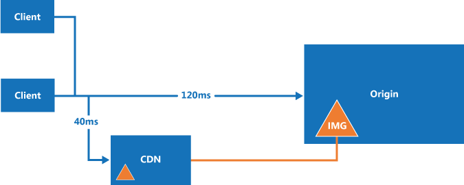

A content delivery network (CDN) is a distributed network of servers that can efficiently deliver web content to users. CDNs store cached content on edge servers that are close to end users to minimize latency.

CDNs are typically used to deliver static content such as images, style sheets, documents, client-side scripts, and HTML pages. The major advantages of using a CDN are lower latency and faster delivery of content to users, regardless of their geographical location in relation to the datacenter where the application is hosted. CDNs can also help to reduce load on a web application, because the application does not have to service requests for the content that is hosted in the CDN.
In Azure, the Azure Content Delivery Network is a global CDN solution for delivering high-bandwidth content that is hosted in Azure or any other location. Using Azure Content Delivery Network, you can cache publicly available objects loaded from Azure blob storage, a web application, virtual machine, any publicly accessible web server.

### How and why a CDN is used
- Delivering static resources for client applications, often from a website. These resources can be images, style sheets, documents, files, client-side scripts, HTML pages, HTML fragments, or any other content that the server does not need to modify for each request. The application can create items at runtime and make them available to the CDN (for example, by creating a list of current news headlines), but it does not do so for each request.

- Delivering public static and shared content to devices such as mobile phones and tablet computers. The application itself is a web service that offers an API to clients running on the various devices. The CDN can also deliver static datasets (via the web service) for the clients to use, perhaps to generate the client UI. For example, the CDN could be used to distribute JSON or XML documents.

- Serving entire websites that consist of only public static content to clients, without requiring any dedicated compute resources.

- Streaming video files to the client on demand. Video benefits from the low latency and reliable connectivity available from the globally located datacenters that offer CDN connections. 

- Generally improving the experience for users, especially those located far from the datacenter hosting the application. These users might otherwise suffer higher latency. A large proportion of the total size of the content in a web application is often static, and using the CDN can help to maintain performance and overall user experience while eliminating the requirement to deploy the application to multiple datacenters. 

- Supporting IoT (Internet of Things) solutions. The huge numbers of devices and appliances involved in an IoT solution could easily overwhelm an application if it had to distribute firmware updates directly to each device.

- Coping with peaks and surges in demand without requiring the application to scale, avoiding the consequent increase in running costs. For example, when an update to an operating system is released for a hardware device such as a specific model of router, or for a consumer device such as a smart TV, there will be a huge peak in demand as it is downloaded by millions of users and devices over a short period.

### Challenges
- Deployment. Decide the origin from which the CDN fetches the content, and whether you need to deploy the content in more than one storage system. Take into account the process for deploying static content and resources. For example, you may need to implement a separate step to load content into Azure blob storage.

- Versioning and cache-control. Consider how you will update static content and deploy new versions. Understand how the CDN performs caching and time-to-live (TTL). For Azure Content Delivery Network

- Testing. It can be difficult to perform local testing of your CDN settings when developing and testing an application locally or in a staging environment.

- Search engine optimization (SEO). Content such as images and documents are served from a different domain when you use the CDN. This can have an effect on SEO for this content.

- Content security. Not all CDNs offer any form of access control for the content. Some CDN services, including Azure Content Delivery Network, support token-based authentication to protect CDN content. For more information, see Securing Azure Content Delivery Network assets with token authentication.

- Client security. Clients might connect from an environment that does not allow access to resources on the CDN. This could be a security-constrained environment that limits access to only a set of known sources, or one that prevents loading of resources from anything other than the page origin. A fallback implementation is required to handle these cases.

- Resilience. The CDN is a potential single point of failure for an application.

Scenarios where a CDN may be less useful include:

- If the content has a low hit rate, it might be accessed only few times while it is valid (determined by its time-to-live setting).

- If the data is private, such as for large enterprises or supply chain ecosystems.

### General guidelines and good practices
Using a CDN is a good way to minimize the load on your application, and maximize availability and performance. Consider adopting this strategy for all of the appropriate content and resources your application uses. Consider the points in the following sections when designing your strategy to use a CDN.
#### Deployment
Static content may need to be provisioned and deployed independently from the application if you do not include it in the application deployment package or process. Consider how this will affect the versioning approach you use to manage both the application components and the static resource content.

Consider using bundling and minification techniques to reduce load times for clients. Bundling combines multiple files into a single file. Minification removes unnecessary characters from scripts and CSS files without altering functionality.

If you need to deploy the content to an additional location, this will be an extra step in the deployment process. If the application updates the content for the CDN, perhaps at regular intervals or in response to an event, it must store the updated content in any additional locations as well as the endpoint for the CDN.

Consider how you will handle local development and testing when some static content is expected to be served from a CDN. For example, you could predeploy the content to the CDN as part of your build script. Alternatively, use compile directives or flags to control how the application loads the resources. For example, in debug mode, the application could load static resources from a local folder. In release mode, the application would use the CDN.

Consider the options for file compression, such as gzip (GNU zip). Compression may be performed on the origin server by the web application hosting or directly on the edge servers by the CDN.

#### Routing and versioning
You may need to use different CDN instances at various times. For example, when you deploy a new version of the application you may want to use a new CDN and retain the old CDN (holding content in an older format) for previous versions. If you use Azure blob storage as the content origin, you can create a separate storage account or a separate container and point the CDN endpoint to it.

Do not use the query string to denote different versions of the application in links to resources on the CDN because, when retrieving content from Azure blob storage, the query string is part of the resource name (the blob name). This approach can also affect how the client caches resources.

Deploying new versions of static content when you update an application can be a challenge if the previous resources are cached on the CDN. 

Consider restricting the CDN content access by country/region. Azure Content Delivery Network allows you to filter requests based on the country or region of origin and restrict the content delivered.

#### Cache control
Consider how to manage caching within the system. For example, in Azure Content Delivery Network, you can set global caching rules, and then set custom caching for particular origin endpoints. You can also control how caching is performed in a CDN by sending cache-directive headers at the origin..

To prevent objects from being available on the CDN, you can delete them from the origin, remove or delete the CDN endpoint, or in the case of blob storage, make the container or blob private. However, items are not removed from the CDN until the time to live expires. You can also manually purge a CDN endpoint.

How caching works

##### Introduction to caching
Caching is the process of storing data locally so that future requests for that data can be accessed more quickly. In the most common type of caching, web browser caching, a web browser stores copies of static data locally on a local hard drive. By using caching, the web browser can avoid making multiple round-trips to the server and instead access the same data locally, thus saving time and resources. Caching is well-suited for locally managing small, static data such as static images, CSS files, and JavaScript files.

Similarly, caching is used by a content delivery network on edge servers close to the user to avoid requests traveling back to the origin and reducing end-user latency. Unlike a web browser cache, which is used only for a single user, the content delivery network has a shared cache. In a content delivery network shared cache, a file request by a user can be used by another user, which greatly decreases the number of requests to the origin server.

Dynamic resources that change frequently or are unique to an individual user can't be cached. Those types of resources, however, can take advantage of dynamic site acceleration (DSA) optimization on the Azure content delivery network for performance improvements.

Caching can occur at multiple levels between the origin server and the end user:
- Web server: Uses a shared cache (for multiple users).
- Content delivery network: Uses a shared cache (for multiple users).
- Internet service provider (ISP): Uses a shared cache (for multiple users).
- Web browser: Uses a private cache (for one user).
Each cache typically manages its own resource freshness and performs validation when a file is stale. This behavior is defined in the HTTP caching specification

##### Resource freshness
Since a cached resource can potentially be out-of-date, or stale (as compared to the corresponding resource on the origin server), it's important for any caching mechanism to control when content gets a refresh. To save time and bandwidth consumption, a cached resource isn't compared to the version on the origin server every time it's accessed. Instead, as long as a cached resource is considered to be fresh, it's assumed to be the most current version and is sent directly to the client. A cached resource is considered to be fresh when its age is less than the age or period defined by a cache setting. For example, when a browser reloads a web page, it verifies that each cached resource on your hard drive is fresh and loads it. If the resource isn't fresh (stale), an up-to-date copy is loaded from the server.

##### Validation
If a resource is considered stale, the origin server gets asked to validate it to determine whether the data in the cache still matches what's on the origin server. If the file has been modified on the origin server, the cache updates its version of the resource. Otherwise, if the resource is fresh, the data is delivered directly from the cache without validating it first.

##### Content delivery network caching
Caching is integral to the way a content delivery network operates to speed up delivery and reduce origin load for static assets such as images, fonts, and videos. In content delivery network caching, static resources are selectively stored on strategically placed servers that are more local to a user and offers the following advantages:
- Because most web traffic is static (for example, images, fonts, and videos), content delivery network caching reduces network latency by moving content closer to the user, thus reducing the distance that data travels.
- By offloading work to a content delivery network, caching can reduce network traffic and the load on the origin server. Doing so reduces cost and resource requirements for the application, even when there are large numbers of users.

Similar to how caching is implemented in a web browser, you can control how caching is performed in a content delivery network by sending cache-directive headers. Cache-directive headers are HTTP headers, which are typically added by the origin server. Although most of these headers were originally designed to address caching in client browsers, they're now also used by all intermediate caches, such as content delivery networks.

Two headers can be used to define cache freshness: Cache-Control and Expires. Cache-Control is more current and takes precedence over Expires, if both exist. There are also two types of headers used for validation (called validators): ETag and Last-Modified. ETag is more current and takes precedence over Last-Modified, if both are defined.

##### Cache-directive headers
Azure Content Delivery Network supports the following HTTP cache-directive headers, which define cache duration and cache sharing.
Cache-Control:
- Introduced in HTTP 1.1 to give web publishers more control over their content and to address the limitations of the Expires header.
- Overrides the Expires header, if both it and Cache-Control are defined.
- When used in an HTTP request from the client to the content delivery network POP, Cache-Control gets ignored by all Azure Content Delivery Network profiles, by default.
- When used in an HTTP response from the origin server to the content delivery network POP, Cache-Control is honored by all Azure Content Delivery Network profiles, by default. Azure CDN also honors caching behaviors for Cache-Control directives in RFC 7234 - Hypertext Transfer Protocol (HTTP/1.1): Caching (ietf.org).

Expires:
- Legacy header introduced in HTTP 1.0; supported for backward compatibility.
- Uses a date-based expiration time with second precision.
- Similar to Cache-Control: max-age.
- Used when Cache-Control doesn't exist.

Pragma:
- Not honored by Azure Content Delivery Network, by default.
- Legacy header introduced in HTTP 1.0; supported for backward compatibility.
- Used as a client request header with the following directive: no-cache. This directive instructs the server to deliver a fresh version of the resource.
- Pragma: no-cache is equivalent to Cache-Control: no-cache.

##### Determining which files can be cached
Not all resources can be cached. The following table shows what resources can be cached, based on the type of HTTP response. Resources delivered with HTTP responses that don't meet all of these conditions can't be cached.
For caching to work on a resource, the origin server must support any HEAD and GET HTTP requests and the content-length values must be the same for any HEAD and GET HTTP responses for the asset. For a HEAD request, the origin server must support the HEAD request, and must respond with the same headers as if it received a GET request.

##### Default caching behavior
The default caching behavior for Azure CDN is to Honor origin and cache content for two days.

Honor origin: This setting specifies whether to respect the cache-directive headers (Cache-Control or Expires) if they are present in the HTTP response from the origin server.

CDN cache duration: This setting specifies the duration for which a resource is cached on the Azure CDN. If Honor origin is enabled and the HTTP response from the origin server includes the Cache-Control: max-age or Expires header, Azure CDN will use the duration specified by these headers instead of the default two-day period.

##### Caching rules
Azure Content Delivery Network offers two ways to control how your files get cached:
- Caching rules: Azure Content Delivery Network provides two types of caching rules: global and custom.
    - Global caching rules - You can set one global caching rule for each endpoint in your profile, which affects all requests to the endpoint. The global caching rule overrides any HTTP cache-directive headers, if set.
    - Custom caching rules - You can set one or more custom caching rules for each endpoint in your profile. Custom caching rules match specific paths and file extensions, get processed in order, and override the global caching rule, if set.
##### Caching behavior settings
For global and custom caching rules, you can specify the following Caching behavior settings:
- Bypass cache: Don't cache and ignore origin-provided cache-directive headers.
- Override: Ignore origin-provided cache duration; use the provided cache duration instead. This setting doesn't override cache-control: no-cache.
- Set if missing: Honor origin-provided cache-directive headers, if they exist; otherwise, use the provided cache duration.

##### Cache expiration duration
For global and custom caching rules, you can specify the cache expiration duration in days, hours, minutes, and seconds:
- For the Override and Set if missing Caching behavior settings, valid cache durations range between 0 seconds and 366 days. For a value of 0 seconds, the content delivery network caches the content, but must revalidate each request with the origin server.
- For the Bypass cache setting, the cache duration gets automatically set to 0 seconds, which isn't a modifiable value.
##### Custom caching rules match conditions
For custom cache rules, two match conditions are available:
- Path: This condition matches the path of the URL, excluding the domain name, and supports the wildcard symbol (*). For example, /myfile.html, /my/folder/**, and /my/images/.jpg. The maximum length is 260 characters.
- Extension: This condition matches the file extension of the requested file. You can provide a list of comma-separated file extensions to match. For example, .jpg, .mp3, or .png. The maximum number of extensions is 50 and the maximum number of characters per extension is 16.
##### Global and custom rule processing order
Global and custom caching rules get processed in the following order:
- Global caching rules take precedence over the default content delivery network caching behavior (HTTP cache-directive header settings).
- Custom caching rules take precedence over global caching rules, where they apply. Custom caching rules get processed in order from top to bottom. That is, if a request matches both conditions, rules at the bottom of the list take precedence over rules at the top of the list. Therefore, you should place more specific rules lower in the list.
Example:
- Global caching rule:
    - Caching behavior: Override
    - Cache expiration duration: One day
- Custom caching rule #1:
    - Match condition: Path
    - Match value: /home/*
    - Caching behavior: Override
    - Cache expiration duration: Two days
- Custom caching rule #2:
    - Match condition: Extension
    - Match value: .html
    - Caching behavior: Set if missing
    - Cache expiration duration: Three days
When you set these rules, a request for <endpoint hostname>.azureedge.net/home/index.html triggers custom caching rule #2, which get set to: Set if missing and 3 days. Therefore, if the index.html file has Cache-Control or Expires HTTP headers, they get honored; otherwise, if you don't set these headers, the file gets cached for three days.

#### CDN fallback
Consider how your application will cope with a failure or temporary unavailability of the CDN. Client applications may be able to use copies of the resources that were cached locally (on the client) during previous requests, or you can include code that detects failure and instead requests resources from the origin (the application folder or Azure blob container that holds the resources) if the CDN is unavailable.

