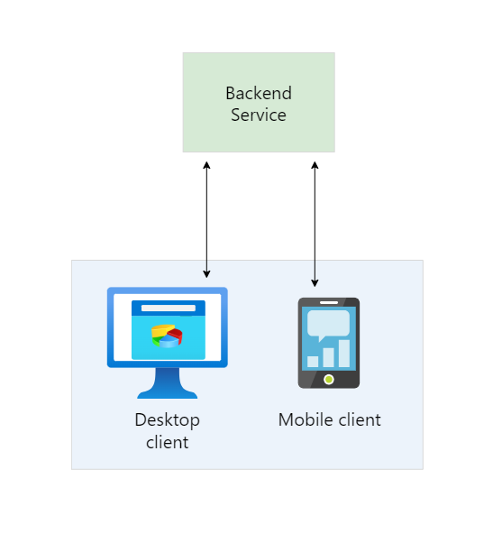
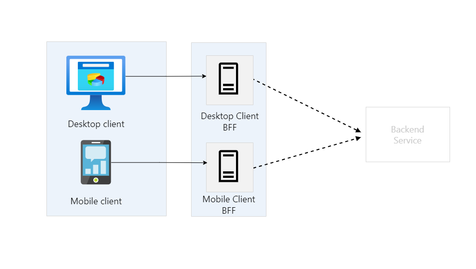

Decouple backend services from the frontend implementations to tailor experiences for different client interfaces. This pattern is useful when you want to avoid customizing a backend that serves multiple interfaces. This pattern is based on Pattern: Backends For Frontends described by Sam Newman.

### Context and problem
Consider an application that was initially designed with a desktop web UI and a corresponding backend service. As business requirements changed over time, a mobile interface was added. Both interfaces interact with the same backend service but the capabilities of a mobile device differ significantly from a desktop browser, in terms of screen size, performance, and display limitations.

The backend service often faces competing demands from different frontends, leading to frequent changes and potential bottlenecks in the development process. Conflicting updates and the need to maintain compatibility result in excessive work on a single deployable resource.

Having a separate team manage the backend service can create a disconnect between frontend and backend teams, causing delays in gaining consensus and balancing requirements. For example, changes requested by one frontend team must be validated with other frontend teams before integration.

### Solution
Introduce a new layer that handles only the interface-specific requirements. This layer called the backend-for-frontend (BFF) service, sits between the frontend client and the backend service. If the application supports multiple interfaces, create a BFF service for each interface. For example, if you have a web interface and a mobile app, you would create separate BFF services for each.

This pattern tailors client experience for a specific interface, without affecting other interfaces. It also fine-tunes the performance to best match the needs of the frontend environment. Because each BFF service smaller and less complex, the application might experience optimization benefits to a certain degree.

Frontend teams have autonomy over their own BFF service, allowing flexibility in language selection, release cadence, workload prioritization, and feature integration without relying on a centralized backend development team.

While many BFFs relied on REST APIs, GraphQL implementations are becoming an alternative, which removes the need for the BFF layer because the querying mechanism doesn't require a separate endpoint.

### Issues and considerations
- Evaluate what the optimal number of services is for you, as this will have associated costs. Maintaining and deploying more services means increased operational overhead. Each individual service has its own life cycle, deployment and maintenance requirements, and security needs.

- Review the Service Level Objectives (SLOs) when adding a new service. Increased latency may occur because clients aren't contacting your services directly, and the new service introduces an extra network hop.

- When different interfaces make the same requests, evaluate whether the requests can be consolidated into a single BFF service. Sharing a single BFF service between multiple interfaces can lead to different requirements for each client, which can complicate the BFF service's growth and support.

- Code duplication is a probable outcome of this pattern. Evaluate the tradeoff between code duplication and a better-tailored experience for each client.

- The BFF service should only handle client-specific logic related to a specific user experience. Cross-cutting features, such as monitoring and authorization, should be abstracted to keep BFF service light. Typical features that might surface in the BFF service are handled separately with Gatekeeping, Rate Limiting, Routing, and others.
    - In this context, "abstract" means to separate or remove certain responsibilities from the BFF service so it remains focused on its core function—handling client-specific logic.Instead of making the BFF service responsible for authentication, monitoring, rate limiting, and other cross-cutting concerns, you shift those duties to dedicated services (like API Gateway, Cognito, or CloudWatch in AWS). This approach keeps the BFF lightweight, maintainable, and optimized for frontend interactions rather than being overloaded with extra tasks

- Consider the impact on the development team when learning and implementing this pattern. Building new backends requires time and effort, potentially incurring technical debt while maintaining the existing backend service.

- Evaluate if you need this pattern at all. For example if your organization uses GraphQL with frontend-specific resolvers, BFF might not add value to your applications.

- Another example is application that combines API Gateway with microservices. This approach may be sufficient for some cases where BFFs were previously recommended.