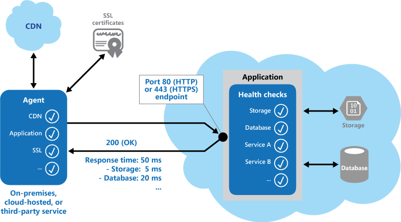

Implement functional checks within an application that external tools can access through exposed endpoints at regular intervals. This pattern can help to verify that applications and services are performing correctly

### Context and Problem
It is good practice—and often a business requirement—to monitor web applications, and middle-tier and shared services, to ensure that they are available and performing correctly. However, it is more difficult to monitor services running in the cloud than it is to monitor on-premises services. For example, you do not have full control of the hosting environment, and the services typically depend on other services provided by platform vendors and others.

There are also many factors that affect cloud-hosted applications such as network latency, the performance and availability of the underlying compute and storage systems, and the network bandwidth between them. The service may fail entirely or partially due to any of these factors. Therefore, you must verify at regular intervals that the service is performing correctly to ensure the required level of availability—which might be part of your Service Level Agreement (SLA).

### Solution
Implement health monitoring by sending requests to an endpoint on the application. The application should perform the necessary checks, and return an indication of its status.

A health monitoring check typically combines two factors: the checks (if any) performed by the application or service in response to the request to the health verification endpoint, and analysis of the result by the tool or framework that is performing the health verification check. The response code indicates the status of the application and, optionally, any components or services it uses. The latency or response time check is performed by the monitoring tool or framework. Figure 1 shows an overview of the implementation of this pattern.

Additional checks that might be carried out by the health monitoring code in the application include:
- Checking cloud storage or a database for availability and response time.
- Checking other resources or services located within the application, or located elsewhere but used by the application.
Several existing services and tools are available for monitoring web applications by submitting a request to a configurable set of endpoints, and evaluating the results against a set of configurable rules. It is relatively easy to create a service endpoint whose sole purpose is to perform some functional tests on the system.

Typical checks that can be performed by the monitoring tools include:
- Validating the response code. For example, an HTTP Response of 200 (OK) indicates that the application responded without error. The monitoring system might also check for other response codes to give a more comprehensive indication of the result.
- Checking the content of the response to detect errors, even when a 200 (OK) status code is returned. This can detect errors that affect only a section of the returned web page or service response. For example, checking the title of a page or looking for a specific phrase that indicates the correct page was returned.
- Measuring the response time, which indicates a combination of the network latency and the time that the application took to execute the request. An increasing value may indicate an emerging problem with the application or network.
- Checking resources or services located outside the application, such as a content delivery network used by the application to deliver content from global caches.
- Checking for expiration of SSL certificates.
- Measuring the response time of a DNS lookup for the URL of the application in order to measure DNS latency and DNS failures.
- Validating the URL returned by the DNS lookup to ensure correct entries. This can help to avoid malicious request redirection through a successful attack on the DNS server.
It is also useful, where possible, to run these checks from different on-premises or hosted locations to measure and compare response times from different places. Ideally you should monitor applications from locations that are close to customers in order to get an accurate view of the performance from each location. In addition to providing a more robust checking mechanism, the results may influence the choice of deployment location for the application—and whether to deploy it in more than one datacenter.

Tests should also be run against all the service instances that customers use to ensure the application is working correctly for all customers. For example, if customer storage is spread across more than one storage account, the monitoring process must check all of these.

### When to Use this Pattern
This pattern is ideally suited for:
- Monitoring websites and web applications to verify availability.
- Monitoring websites and web applications to check for correct operation.
- Monitoring middle-tier or shared services to detect and isolate a failure that could disrupt other applications.
- To complement existing instrumentation within the application, such as performance counters and error handlers. Health verification checking does not replace the requirement for logging and auditing in the application. Instrumentation can provide valuable information for an existing framework that monitors counters and error logs to detect failures or other issues. However, it cannot provide information if the application is unavailable.